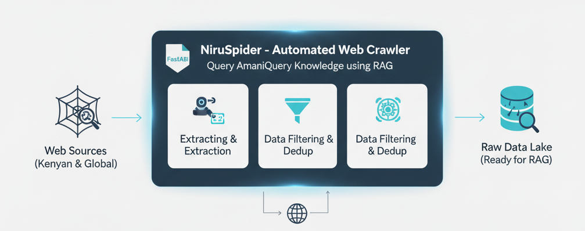

# Module 1: NiruSpider - Data Ingestion Crawler



This module handles automated web crawling and data collection from various Kenyan and global sources.

## Structure

```
Module1_NiruSpider/
├── niruspider/
│   ├── __init__.py
│   ├── spiders/
│   │   ├── __init__.py
│   │   ├── kenya_law_new_spider.py
│   │   ├── parliament_spider.py
│   │   ├── news_rss_spider.py
│   │   └── global_trends_spider.py
│   ├── items.py
│   ├── middlewares.py
│   ├── pipelines.py
│   └── settings.py
├── scrapy.cfg
└── crawl_all.py
```

## Spiders

### 1. Kenya Law Spider (New)

Crawls comprehensive legal resources from **https://new.kenyalaw.org**.

**Target Sources:**
- Constitution of Kenya 2010 (article-level)
- Acts of Parliament (500+ acts, section-level)
- Bills (all types)
- Subsidiary Legislation
- County Legislation
- Case Law & Judgments (300k+ decisions from all courts)
- Kenya Gazette (8,000+ gazettes from 1899-2025)
- Treaties & International Agreements
- Publications (journals, reports)
- Cause Lists (daily court schedules)
- Legal Blog Articles

**Features:**
- Comprehensive coverage of all legal resources
- Article/section-level content extraction
- Court hierarchy support (Supreme, Appellate, High, Lower courts)
- Historical gazette archives (1899-present)
- Pagination support for all content types
- PDF and HTML document handling
- Metadata extraction (dates, authors, citation numbers)

### 2. Parliament Spider

Fetches parliamentary proceedings and documents.

**Target Sources:**
- Hansards (debates)
- Bills under consideration
- Committee reports
- Publications

**Features:**
- PDF document handling
- Metadata extraction
- Speaker identification

### 3. News RSS Spider

Parses Kenyan news from RSS feeds.

**Target Sources:**
- Nation Africa
- Standard Media
- The Star
- Business Daily Africa

**Features:**
- Real-time RSS feed parsing
- Article content extraction
- Author and date metadata

### 4. Global Trends Spider

Fetches global news, geopolitics, international organizations, and policy analysis.

**Target Sources:**
- **Geopolitics**: Reuters World, BBC, Al Jazeera, Foreign Policy
- **International Orgs**: UN, WHO, World Bank, IMF, African Union
- **Technology**: Reuters Tech, TechCrunch, MIT Technology Review
- **Policy Think Tanks**: The Economist, Brookings Institution, CFR
- **Climate & Development**: UN Climate Change, UNDP

**Features:**
- RSS feed parsing from 17+ international sources
- Keyword filtering for Africa/Kenya relevance
- Focus on geopolitics, policy, governance, international law, development
- Captures institutional announcements and policy papers
- Filters for: Africa, Kenya, policy, governance, AI, climate, trade, diplomacy, human rights

## Features

- **Asynchronous Crawling**: Uses Scrapy for high-performance concurrent requests
- **Polite Crawling**: Respects robots.txt and implements delays
- **RSS Feed Support**: Efficient parsing of news feeds
- **PDF Handling**: Downloads and queues PDFs for processing
- **Error Handling**: Robust retry logic and error logging

## Usage

### Single Spider
```bash
cd Module1_NiruSpider
scrapy crawl kenya_law
scrapy crawl parliament
scrapy crawl news_rss
scrapy crawl global_trends
```

### All Spiders
```bash
python crawl_all.py
```

## Configuration

Edit `settings.py` for:
- Download delays
- Concurrent requests
- User agent
- Output formats

## Output

Raw data saved to: `../data/raw/<source_name>/`
- HTML files
- PDF files
- JSON metadata
