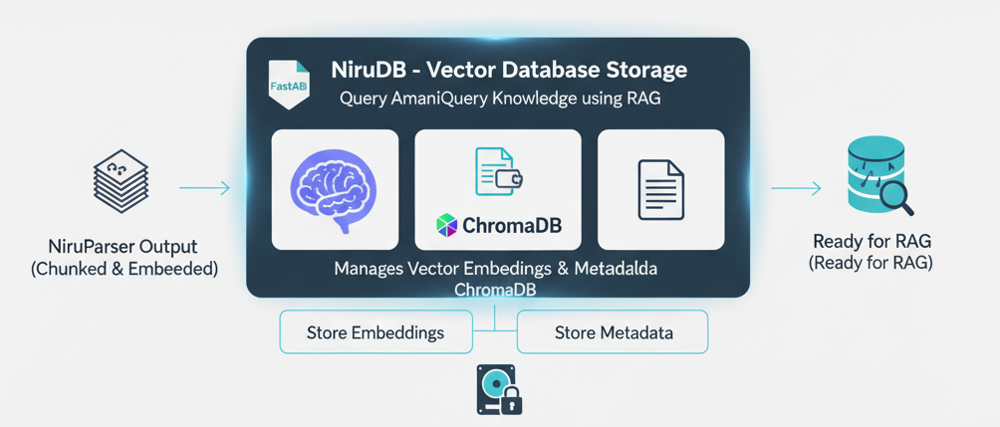

# Module 3: NiruDB - Vector Database Storage



This module manages vector embeddings and metadata storage using ChromaDB.

## Features

- **Vector Storage**: Efficient storage and retrieval of embeddings
- **Metadata Management**: Store and query document metadata
- **Similarity Search**: Find semantically similar documents
- **Persistence**: Data persists across sessions

## Components

### VectorStore (`vector_store.py`)
- Initialize and manage ChromaDB collections
- Add documents with embeddings
- Query for similar documents
- Delete and update documents

### MetadataManager (`metadata_manager.py`)
- Manage document metadata
- Filter by category, date, source
- Extract citation information

## Usage

### Initialize Database
```python
from Module3_NiruDB import VectorStore

db = VectorStore()
```

### Add Documents
```python
db.add_documents(chunks)  # chunks from Module 2
```

### Query
```python
results = db.query(
    query_text="What are the recent parliamentary debates?",
    n_results=5,
    filter={"category": "Parliament"}
)
```

## Storage

Data stored in: `../data/chroma_db/`
- Vector embeddings
- Metadata
- Collection indexes
