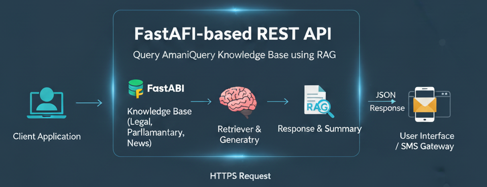

# Module 4: NiruAPI - RAG-Powered Query Interface



This module provides a FastAPI-based REST API for querying the AmaniQuery knowledge base using Retrieval-Augmented Generation (RAG).

## Features

- **RAG Pipeline**: Combines vector search with LLM generation
- **Source Citations**: Always includes source references
- **REST API**: Easy integration with any client
- **Multiple LLM Support**: Moonshot AI (default), OpenAI, Anthropic, or local models
- **Filtering**: Query by category, source, date range

## Components

### API Server (`api.py`)
- FastAPI application
- Query endpoints
- Health checks
- CORS support

### RAG Pipeline (`rag_pipeline.py`)
- Retrieval from vector database
- Context preparation
- LLM prompt engineering
- Response generation with citations

## API Endpoints

### `POST /query`
Main query endpoint

**Request:**
```json
{
  "query": "What are the recent parliamentary debates on finance?",
  "top_k": 5,
  "category": "Parliament",
  "include_sources": true
}
```

**Response:**
```json
{
  "answer": "Recent parliamentary debates have focused on...",
  "sources": [
    {
      "title": "Finance Bill 2025 Debate",
      "url": "https://parliament.go.ke/...",
      "relevance_score": 0.92
    }
  ],
  "query_time": 1.24
}
```

### `GET /health`
Health check endpoint

### `GET /stats`
Database statistics

## Usage

### Start Server
```bash
python -m Module4_NiruAPI.api
# or
uvicorn Module4_NiruAPI.api:app --reload
```

### Query from Python
```python
import requests

response = requests.post(
    "http://localhost:8000/query",
    json={"query": "What is the Kenyan Constitution on freedom of speech?"}
)
print(response.json()["answer"])
```

### Query from cURL
```bash
curl -X POST http://localhost:8000/query \
  -H "Content-Type: application/json" \
  -d '{"query": "Recent news on AI policy in Kenya"}'
```

## Configuration

Set in `.env`:
- `LLM_PROVIDER`: moonshot (default), openai, anthropic, or local
- `MOONSHOT_API_KEY`: Your Moonshot AI API key
- `MOONSHOT_BASE_URL`: Moonshot API endpoint (default: https://api.moonshot.cn/v1)
- `DEFAULT_MODEL`: Model to use (moonshot-v1-8k, moonshot-v1-32k, moonshot-v1-128k)
- `API_PORT`: Port to run on (default: 8000)

**Available Moonshot Models:**
- `moonshot-v1-8k`: 8K context window (fastest, most cost-effective)
- `moonshot-v1-32k`: 32K context window (balanced)
- `moonshot-v1-128k`: 128K context window (maximum context)
