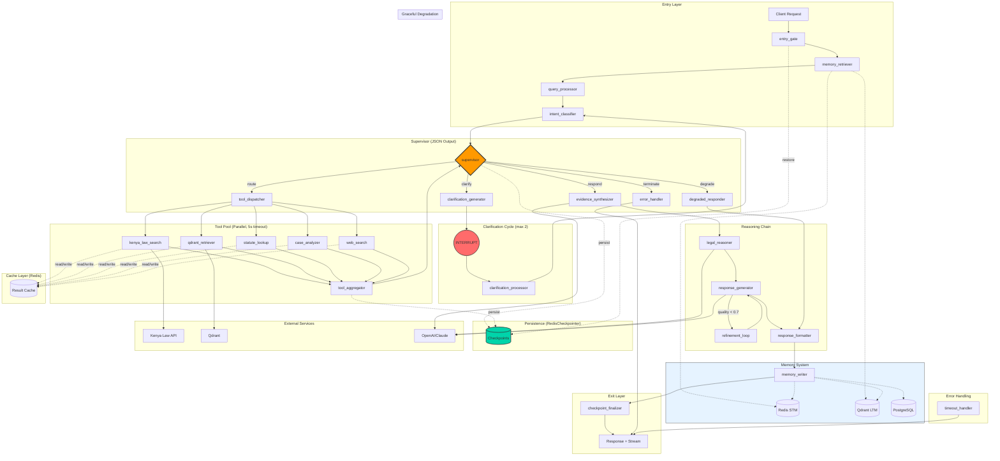

# AmaniQ v2 Architecture Document

**Version:** 2.0.0  
**Author:** Eng. Onyango Benard 
**Date:** November 27, 2025  
**Status:** Architecture Review

---

## Executive Summary

AmaniQ v2 is a production-grade Kenyan legal research agent built on LangGraph (StateGraph + Pregel) designed to serve 5,000+ daily active users with sub-3.5s p99 latency on constrained infrastructure ($40/month Johannesburg server). The system prioritizes resilience, graceful degradation, and conversational memory.

---

## 1. Typed AgentState Schema

```
AgentState (TypedDict)
├── session_id: str                                    # Unique session identifier (UUID4)
├── user_id: str                                       # User identifier for memory retrieval
├── conversation_id: str                               # Conversation thread ID
│
├── messages: Annotated[list[BaseMessage], operator.add]  # Full conversation history (append-only)
├── memory_context: Annotated[list[MemoryEntry], operator.add]  # Retrieved long-term memories
├── working_memory: dict[str, Any]                     # Current session scratch space
│
├── query: str                                         # Current user query (normalized)
├── query_language: Literal["en", "sw"]                # Detected language (English/Swahili)
├── query_intent: QueryIntent                          # Structured intent classification
├── query_embedding: list[float] | None               # Cached query vector (768-dim)
│
├── clarification_needed: bool                         # Triggers clarification cycle
├── clarification_question: str | None                 # Question to ask user
├── clarification_count: int                           # Max 2 clarifications per query
│
├── tool_calls: Annotated[list[ToolCall], operator.add]     # Scheduled tool invocations
├── tool_results: Annotated[list[ToolResult], operator.add] # Completed tool outputs
├── tool_errors: Annotated[list[ToolError], operator.add]   # Failed tool attempts
│
├── retrieved_documents: Annotated[list[Document], operator.add]  # RAG results
├── retrieved_cases: Annotated[list[CaseDocument], operator.add]  # Kenya Law cases
├── retrieved_statutes: Annotated[list[StatuteDocument], operator.add]  # Legislation
│
├── reasoning_steps: Annotated[list[ReasoningStep], operator.add]  # Chain-of-thought trace
├── draft_response: str | None                         # Pre-final response
├── final_response: str | None                         # User-facing response
│
├── supervisor_decision: SupervisorDecision | None     # Structured routing decision
├── current_node: str                                  # Active node name
├── visited_nodes: Annotated[list[str], operator.add]  # Execution trace
│
├── retry_count: dict[str, int]                        # Per-tool retry tracking
├── cache_hits: Annotated[list[str], operator.add]     # Cache hit log
├── degraded_mode: bool                                # Graceful degradation active
├── degradation_reason: str | None                     # Why degraded
│
├── started_at: float                                  # Unix timestamp
├── deadline: float                                    # started_at + 3.5s budget
├── node_timings: dict[str, float]                     # Per-node latency tracking
│
├── error: str | None                                  # Terminal error message
├── status: Literal["pending", "processing", "clarifying", "complete", "error", "timeout"]
└── metadata: dict[str, Any]                           # Extensible metadata bag
```

### Supporting Types

```
QueryIntent (TypedDict)
├── primary_intent: Literal["case_search", "statute_lookup", "legal_advice", 
│                           "procedure_question", "document_draft", "clarification"]
├── entities: list[Entity]                             # Extracted legal entities
├── jurisdiction: Literal["kenya", "eac", "commonwealth"] | None
├── time_scope: TimeScope | None                       # Date range filter
└── confidence: float                                  # 0.0 - 1.0

MemoryEntry (TypedDict)
├── memory_id: str                                     # Unique memory identifier
├── user_id: str                                       # Owner
├── memory_type: Literal["fact", "preference", "context", "entity"]
├── content: str                                       # Memory content
├── embedding: list[float]                             # Vector for similarity search
├── importance: float                                  # 0.0 - 1.0 decay-adjusted score
├── access_count: int                                  # Retrieval frequency
├── created_at: float                                  # Unix timestamp
├── last_accessed: float                               # For LRU + importance decay
└── metadata: dict[str, Any]                           # Source, tags, etc.

SupervisorDecision (TypedDict)
├── next_action: Literal["route", "clarify", "respond", "retry", "degrade", "terminate"]
├── target_nodes: list[str]                            # Parallel execution targets
├── reasoning: str                                     # Brief explanation
├── confidence: float                                  # Decision confidence
├── time_budget_ms: int                                # Remaining time allocation
└── fallback_strategy: str | None                      # If primary fails

ToolCall (TypedDict)
├── tool_id: str                                       # UUID for tracking
├── tool_name: str                                     # Tool identifier
├── arguments: dict[str, Any]                          # Tool input
├── priority: int                                      # Execution order (lower = higher)
├── timeout_ms: int                                    # Default 5000ms
├── scheduled_at: float                                # When queued
└── cache_key: str | None                              # For result caching

ToolResult (TypedDict)
├── tool_id: str                                       # Matches ToolCall.tool_id
├── tool_name: str
├── result: Any                                        # Tool output
├── latency_ms: int                                    # Execution time
├── from_cache: bool                                   # Cache hit indicator
└── completed_at: float

ToolError (TypedDict)
├── tool_id: str
├── tool_name: str
├── error_type: Literal["timeout", "network", "rate_limit", "validation", "internal"]
├── error_message: str
├── retry_count: int
├── recoverable: bool
└── occurred_at: float

ReasoningStep (TypedDict)
├── step_id: int
├── node: str                                          # Which node produced this
├── thought: str                                       # Reasoning content
├── action: str | None                                 # Action taken
├── observation: str | None                            # Result observed
└── timestamp: float
```

---

## 2. Node List and Responsibilities

### 2.1 Entry Nodes

| Node | Responsibility | Timeout | Retry |
|------|---------------|---------|-------|
| `entry_gate` | Rate limiting, session validation, deadline calculation | 100ms | 0 |
| `memory_retriever` | Fetch relevant long-term memories for user context | 300ms | 1 |
| `query_processor` | Language detection, normalization, embedding generation | 200ms | 1 |
| `intent_classifier` | Structured intent extraction with entity recognition | 400ms | 1 |

### 2.2 Supervisor Node

| Node | Responsibility | Timeout | Retry |
|------|---------------|---------|-------|
| `supervisor` | JSON-only routing decisions, parallel tool dispatch, cycle control | 500ms | 0 |

**Supervisor Output Schema (Structured JSON Only):**
```json
{
  "decision": "route|clarify|respond|retry|degrade|terminate",
  "targets": ["node_name_1", "node_name_2"],
  "parallel": true,
  "reasoning": "Brief explanation",
  "confidence": 0.85,
  "time_budget_ms": 2500,
  "fallback": "fallback_node_name"
}
```

### 2.3 Tool Nodes (Parallel Execution Pool)

| Node | Responsibility | Timeout | Retry | Cache TTL |
|------|---------------|---------|-------|-----------|
| `kenya_law_search` | Query Kenya Law Reports API/scraper | 5000ms | 2 | 1h |
| `qdrant_retriever` | Vector similarity search on local embeddings | 500ms | 1 | 5m |
| `statute_lookup` | Legislation database search | 3000ms | 2 | 2h |
| `case_analyzer` | Deep analysis of retrieved cases | 2000ms | 1 | 30m |
| `citation_extractor` | Extract and validate legal citations | 1000ms | 1 | 1h |
| `web_search` | Fallback general web search (DuckDuckGo) | 4000ms | 1 | 15m |

### 2.4 Memory Nodes

| Node | Responsibility | Timeout | Retry |
|------|---------------|---------|-------|
| `memory_retriever` | Semantic search over user's memory store | 300ms | 1 |
| `memory_consolidator` | Extract and store new memories from conversation | 200ms | 0 |
| `memory_ranker` | Score and filter memories by relevance + recency | 100ms | 0 |

### 2.5 Reasoning Nodes

| Node | Responsibility | Timeout | Retry |
|------|---------------|---------|-------|
| `evidence_synthesizer` | Combine tool results into coherent evidence | 800ms | 1 |
| `legal_reasoner` | Apply legal reasoning patterns to evidence | 1000ms | 1 |
| `response_generator` | Generate user-facing response with citations | 1200ms | 1 |

### 2.6 Cycle Nodes

| Node | Responsibility | Timeout | Retry |
|------|---------------|---------|-------|
| `clarification_generator` | Generate clarifying question | 400ms | 0 |
| `clarification_processor` | Process user's clarification response | 200ms | 0 |
| `refinement_loop` | Iterative improvement of response quality | 600ms | 0 |

### 2.7 Exit Nodes

| Node | Responsibility | Timeout | Retry |
|------|---------------|---------|-------|
| `response_formatter` | Final formatting, language localization | 100ms | 0 |
| `memory_writer` | Persist new memories to long-term store | 200ms | 0 |
| `checkpoint_finalizer` | Final state persistence, cleanup | 100ms | 0 |
| `error_handler` | Graceful error response generation | 200ms | 0 |
| `timeout_handler` | Deadline exceeded response | 50ms | 0 |

---

## 3. Complete Routing Table

### 3.1 Linear Edges

```
entry_gate ──────────────► memory_retriever
memory_retriever ─────────► query_processor
query_processor ──────────► intent_classifier
intent_classifier ────────► supervisor
evidence_synthesizer ─────► legal_reasoner
legal_reasoner ───────────► response_generator
response_generator ───────► response_formatter
response_formatter ───────► memory_writer
memory_writer ────────────► checkpoint_finalizer
checkpoint_finalizer ─────► END
```

### 3.2 Conditional Edges from Supervisor

```python
# Supervisor routing logic (conceptual)
def route_supervisor(state: AgentState) -> list[str]:
    decision = state["supervisor_decision"]
    
    match decision["next_action"]:
        case "route":
            return decision["target_nodes"]  # Parallel dispatch
        case "clarify":
            return ["clarification_generator"]
        case "respond":
            return ["evidence_synthesizer"]
        case "retry":
            return decision["target_nodes"]  # Re-execute failed tools
        case "degrade":
            return ["degraded_responder"]
        case "terminate":
            return ["error_handler"]
```

**Supervisor Conditional Edge Table:**

| Condition | Target Node(s) | Parallel |
|-----------|---------------|----------|
| `intent == case_search` | `kenya_law_search`, `qdrant_retriever` | ✅ |
| `intent == statute_lookup` | `statute_lookup`, `qdrant_retriever` | ✅ |
| `intent == legal_advice` | `qdrant_retriever`, `case_analyzer` | ✅ |
| `intent == procedure_question` | `qdrant_retriever` | ❌ |
| `clarification_needed == true` | `clarification_generator` | ❌ |
| `all_tools_complete == true` | `evidence_synthesizer` | ❌ |
| `deadline_exceeded == true` | `timeout_handler` | ❌ |
| `unrecoverable_error == true` | `error_handler` | ❌ |
| `kenya_law_down == true` | `web_search`, `qdrant_retriever` | ✅ |

### 3.3 Cycle Edges

#### Clarification Cycle
```
supervisor ───[clarification_needed]───► clarification_generator
clarification_generator ───────────────► INTERRUPT (await user input)
(user responds)
clarification_processor ───────────────► intent_classifier
intent_classifier ─────────────────────► supervisor
```

**Clarification Cycle Constraints:**
- Maximum 2 clarifications per query (`clarification_count < 2`)
- Auto-proceed with best-effort after 2 cycles
- Timeout after 30s waiting for user response

#### Multi-Turn Reasoning Cycle
```
supervisor ───[need_more_evidence]───► tool_nodes (parallel)
tool_nodes ──────────────────────────► tool_aggregator
tool_aggregator ─────────────────────► supervisor
supervisor ───[sufficient_evidence]──► evidence_synthesizer
```

**Reasoning Cycle Constraints:**
- Maximum 3 tool execution rounds
- Budget-aware: stops if `time_remaining < 800ms`

#### Refinement Cycle
```
response_generator ───[quality_score < 0.7]───► refinement_loop
refinement_loop ──────────────────────────────► response_generator
```

**Refinement Constraints:**
- Maximum 1 refinement iteration
- Only if time budget allows (`time_remaining > 600ms`)

### 3.4 Parallel Execution Groups

```
GROUP tool_parallel_1:
  - kenya_law_search
  - qdrant_retriever
  - statute_lookup
  [JOIN] ► tool_aggregator

GROUP tool_parallel_2 (fallback):
  - web_search
  - qdrant_retriever
  [JOIN] ► tool_aggregator

GROUP memory_parallel:
  - memory_retriever
  - query_processor
  [JOIN] ► intent_classifier
```

---

## 4. Memory Architecture

### 4.1 Memory Hierarchy

```
┌─────────────────────────────────────────────────────────────┐
│                    MEMORY HIERARCHY                          │
├─────────────────────────────────────────────────────────────┤
│                                                              │
│  ┌──────────────────┐                                       │
│  │  Working Memory  │  ◄── Current session state            │
│  │   (AgentState)   │      TTL: Session duration            │
│  └────────┬─────────┘      Storage: Redis Hash              │
│           │                                                  │
│  ┌────────▼─────────┐                                       │
│  │  Short-Term      │  ◄── Recent conversation turns        │
│  │  Memory (STM)    │      TTL: 1 hour                      │
│  └────────┬─────────┘      Storage: Redis List (FIFO)       │
│           │                Max: 20 messages per user         │
│  ┌────────▼─────────┐                                       │
│  │  Episodic        │  ◄── Conversation summaries           │
│  │  Memory          │      TTL: 7 days                      │
│  └────────┬─────────┘      Storage: Redis + Qdrant          │
│           │                                                  │
│  ┌────────▼─────────┐                                       │
│  │  Long-Term       │  ◄── User facts, preferences          │
│  │  Memory (LTM)    │      TTL: 90 days (with decay)        │
│  └────────┬─────────┘      Storage: Qdrant + PostgreSQL     │
│           │                                                  │
│  ┌────────▼─────────┐                                       │
│  │  Semantic        │  ◄── Extracted entities, concepts     │
│  │  Memory          │      TTL: Permanent                   │
│  └──────────────────┘      Storage: Qdrant                  │
│                                                              │
└─────────────────────────────────────────────────────────────┘
```

### 4.2 Memory Operations

#### Memory Retrieval (at query time)
```
1. Embed current query → query_vector
2. Parallel retrieval:
   a. STM: Last 5 messages from Redis List
   b. Episodic: Top 3 similar conversations from Qdrant
   c. LTM: Top 5 relevant facts (similarity + importance score)
3. Re-rank by:
   - Semantic similarity (0.4 weight)
   - Recency decay (0.3 weight)
   - Importance score (0.2 weight)
   - Access frequency (0.1 weight)
4. Return top 10 memories to working memory
```

#### Memory Consolidation (post-response)
```
1. Extract memorable facts from conversation:
   - User preferences ("I prefer Swahili responses")
   - Legal context ("I'm researching employment law")
   - Entities ("Working on case involving XYZ Ltd")
2. Score importance (0.0 - 1.0)
3. Check for duplicates/updates to existing memories
4. Store with embedding in appropriate tier
5. Update access counts for retrieved memories
```

#### Memory Decay Formula
```
effective_importance = base_importance × (0.95 ^ days_since_access) + (0.1 × log(access_count + 1))
```

### 4.3 Memory Redis Schema

```
# Short-term memory (conversation buffer)
Key: amq:stm:{user_id}
Type: List
Value: JSON-encoded messages
Operations: LPUSH, LTRIM (keep last 20), LRANGE

# Memory metadata
Key: amq:mem:meta:{user_id}:{memory_id}
Type: Hash
Fields:
  - content: str
  - type: str
  - importance: float
  - access_count: int
  - created_at: float
  - last_accessed: float
TTL: 90 days (refreshed on access)

# Memory index for fast lookup
Key: amq:mem:idx:{user_id}
Type: Sorted Set
Score: effective_importance
Member: memory_id
```

---

## 5. Recommended Models

### 5.1 Model Selection Matrix

| Role | Model | Reasoning | Fallback |
|------|-------|-----------|----------|
| **Supervisor** | `gpt-4o-mini` | Fast structured output, good routing | `claude-3-haiku` |
| **Intent Classifier** | `gpt-4o-mini` | JSON mode, consistent schema | Local classifier |
| **Legal Reasoner** | `gpt-4o` | Complex reasoning, accuracy critical | `claude-3.5-sonnet` |
| **Response Generator** | `gpt-4o` | Quality output, citation handling | `claude-3.5-sonnet` |
| **Clarification** | `gpt-4o-mini` | Simple question generation | Template-based |
| **Memory Consolidator** | `gpt-4o-mini` | Fact extraction | Regex + rules |
| **Embeddings** | `text-embedding-3-small` | Cost-effective, good quality | `all-MiniLM-L6-v2` |

### 5.2 Model Configuration

```yaml
supervisor:
  model: gpt-4o-mini
  temperature: 0.0
  max_tokens: 256
  response_format: { type: "json_object" }
  timeout_ms: 500

legal_reasoner:
  model: gpt-4o
  temperature: 0.3
  max_tokens: 2048
  timeout_ms: 1000

response_generator:
  model: gpt-4o
  temperature: 0.5
  max_tokens: 1500
  timeout_ms: 1200

embeddings:
  model: text-embedding-3-small
  dimensions: 768
  batch_size: 100
```

### 5.3 Cost Optimization

| Scenario | Model Flow | Est. Cost/Query |
|----------|-----------|-----------------|
| Simple lookup | mini → mini | $0.0003 |
| Standard query | mini → 4o → 4o | $0.003 |
| Complex research | mini → 4o × 2 → 4o | $0.008 |
| With clarification | mini → mini → 4o → 4o | $0.004 |

**Monthly Budget (5,000 DAU × 3 queries avg):**
- Conservative: ~$450/month
- With caching (60% hit rate): ~$180/month

---

## 6. Redis Key Naming Convention

### 6.1 Prefix Schema

```
amq:{category}:{subcategory}:{identifier}:{qualifier}

Categories:
- state    : Agent state checkpoints
- cache    : Tool result caching
- mem      : Memory storage
- session  : Session management
- rate     : Rate limiting
- lock     : Distributed locks
- stream   : Event streaming
- metric   : Metrics/monitoring
```

### 6.2 Complete Key Reference

#### State Management (RedisCheckpointer)
```
amq:state:checkpoint:{session_id}                    # Latest checkpoint
amq:state:checkpoint:{session_id}:{checkpoint_id}   # Specific checkpoint
amq:state:history:{session_id}                       # Checkpoint history (List)
amq:state:pending:{session_id}                       # Pending writes channel
TTL: 24 hours
```

#### Tool Cache
```
amq:cache:kenya_law:{query_hash}                    # Kenya Law results
amq:cache:qdrant:{query_hash}                       # Vector search results
amq:cache:statute:{statute_id}                       # Statute content
amq:cache:embedding:{text_hash}                      # Query embeddings
TTL: Varies by tool (see node table)
```

#### Memory
```
amq:mem:stm:{user_id}                               # Short-term (List)
amq:mem:ltm:idx:{user_id}                           # LTM index (Sorted Set)
amq:mem:ltm:data:{user_id}:{memory_id}             # LTM content (Hash)
amq:mem:episode:{user_id}:{conversation_id}        # Episodic (Hash)
TTL: See memory hierarchy
```

#### Session
```
amq:session:active:{session_id}                     # Active session marker
amq:session:user:{user_id}                          # User's active sessions (Set)
amq:session:meta:{session_id}                       # Session metadata (Hash)
TTL: 1 hour (extended on activity)
```

#### Rate Limiting
```
amq:rate:user:{user_id}:{window}                    # Per-user rate limit
amq:rate:global:{window}                            # Global rate limit
amq:rate:tool:{tool_name}:{window}                  # Per-tool rate limit
TTL: Window duration
```

#### Distributed Locks
```
amq:lock:session:{session_id}                       # Session write lock
amq:lock:memory:{user_id}                           # Memory consolidation lock
amq:lock:tool:{tool_name}                           # Tool execution semaphore
TTL: 30 seconds (with refresh)
```

#### Streams (Event Sourcing)
```
amq:stream:events:{session_id}                      # Session event stream
amq:stream:responses                                # SSE response stream
amq:stream:dlq                                      # Dead letter queue
```

#### Metrics
```
amq:metric:latency:{node_name}:{date}              # Latency histogram (Hash)
amq:metric:errors:{node_name}:{date}               # Error counts (Hash)
amq:metric:throughput:{date}                        # Request counts (Hash)
```

---

## 7. Resilience Architecture

### 7.1 Crash Recovery

```
┌─────────────────────────────────────────────────────────────┐
│                   CRASH RECOVERY FLOW                        │
├─────────────────────────────────────────────────────────────┤
│                                                              │
│  User Request ──► Check for existing checkpoint              │
│                         │                                    │
│            ┌────────────┴────────────┐                      │
│            ▼                         ▼                       │
│     [No checkpoint]           [Checkpoint found]            │
│            │                         │                       │
│            ▼                         ▼                       │
│     Start fresh              Restore state                  │
│            │                         │                       │
│            │                         ▼                       │
│            │                  Validate state                │
│            │                         │                       │
│            │              ┌──────────┴──────────┐           │
│            │              ▼                     ▼            │
│            │        [Valid]              [Corrupted]        │
│            │              │                     │            │
│            │              ▼                     ▼            │
│            │        Resume from           Rollback to       │
│            │        last node             previous          │
│            │              │               checkpoint        │
│            └──────────────┴─────────────────┘               │
│                           │                                  │
│                           ▼                                  │
│                    Continue execution                        │
│                                                              │
└─────────────────────────────────────────────────────────────┘
```

### 7.2 External Service Degradation

| Service | Detection | Degradation Strategy |
|---------|-----------|---------------------|
| Kenya Law Reports | 2 consecutive timeouts | Switch to cached results + web search |
| Qdrant | Connection refused | Fallback to PostgreSQL FTS |
| OpenAI | 429/503 errors | Switch to Claude, then local model |
| Redis | Connection lost | In-memory state (no persistence) |

### 7.3 Circuit Breaker Configuration

```yaml
circuit_breakers:
  kenya_law:
    failure_threshold: 3
    recovery_timeout: 60s
    half_open_requests: 2
  
  openai:
    failure_threshold: 5
    recovery_timeout: 30s
    half_open_requests: 3
  
  qdrant:
    failure_threshold: 3
    recovery_timeout: 45s
    half_open_requests: 2
```

---

## 8. Streaming Architecture

### 8.1 SSE Response Flow

```
Client ◄──SSE──┐
               │
┌──────────────┴───────────────────────────────────────────┐
│                    STREAMING PIPELINE                     │
├──────────────────────────────────────────────────────────┤
│                                                           │
│  response_generator ──► Token Stream ──► SSE Encoder     │
│         │                    │                │           │
│         ▼                    ▼                ▼           │
│  [Start event]        [Token events]    [Done event]     │
│                                                           │
│  Event Format:                                            │
│  {                                                        │
│    "event": "token|status|error|done",                   │
│    "data": {                                              │
│      "session_id": "...",                                │
│      "content": "...",                                    │
│      "node": "...",                                       │
│      "timestamp": 1234567890                             │
│    }                                                      │
│  }                                                        │
│                                                           │
└──────────────────────────────────────────────────────────┘
```

### 8.2 Progress Events

```
event: status
data: {"stage": "understanding", "progress": 0.1}

event: status  
data: {"stage": "searching", "progress": 0.3}

event: status
data: {"stage": "analyzing", "progress": 0.6}

event: token
data: {"content": "Based on ", "index": 0}

event: token
data: {"content": "the Kenya ", "index": 1}

event: done
data: {"total_tokens": 450, "latency_ms": 2340}
```

---

## 9. Infrastructure Sizing

### 9.1 $40/month Server Specification

```yaml
provider: Hetzner (Johannesburg) or Vultr
instance: CX21 equivalent
specs:
  vcpu: 2
  ram: 4GB
  storage: 40GB NVMe
  bandwidth: 20TB
  
resource_allocation:
  api_server: 1.5GB RAM
  redis: 512MB RAM
  qdrant: 1GB RAM
  system: 1GB RAM
```

### 9.2 Concurrency Model

```
1,000 concurrent users target:

Request Pattern:
- Avg query duration: 2.5s
- Queries per user session: 3
- Session duration: 15 min
- Peak hour multiplier: 2.5x

Server Capacity:
- Async workers: 50 (uvicorn)
- Redis connections: 100 (pool)
- Qdrant connections: 20
- External API calls: Parallel (asyncio)

Bottleneck Analysis:
- CPU: LLM calls are I/O bound → OK
- Memory: State size ~10KB × 1000 = 10MB → OK  
- Network: ~500KB/request × 400/min = 200MB/min → OK
- Redis: 10,000 ops/s capacity vs ~2,000 needed → OK
```

### 9.3 Caching Strategy

```yaml
cache_tiers:
  l1_memory:
    type: LRU
    size: 100MB
    ttl: 5min
    hit_rate_target: 40%
    
  l2_redis:
    size: 256MB
    ttl: varies
    hit_rate_target: 30%
    
  l3_qdrant:
    semantic_cache: true
    similarity_threshold: 0.95
    hit_rate_target: 15%

total_cache_hit_target: 60%
```

---

## 10. Mermaid Architecture Diagram



---

## 11. Monitoring & Observability

### 11.1 Key Metrics

| Metric | Target | Alert Threshold |
|--------|--------|-----------------|
| p99 Latency | <3.5s | >4s |
| Error Rate | <1% | >2% |
| Cache Hit Rate | >60% | <40% |
| Memory Retrieval Relevance | >0.7 | <0.5 |
| Checkpoint Success | >99.9% | <99% |
| Kenya Law Availability | >95% | <90% |

### 11.2 Distributed Tracing

```
Trace ID propagation:
  session_id → span_id → tool_call_id

Spans:
  - amq.entry
  - amq.memory.retrieve
  - amq.supervisor.decide
  - amq.tool.{tool_name}
  - amq.reason.synthesize
  - amq.respond.generate
  - amq.memory.write
```

---

## 12. Security Considerations

### 12.1 Memory Privacy

```yaml
memory_privacy:
  encryption: AES-256-GCM for LTM content
  key_derivation: user_id + master_key (HKDF)
  retention: 90 days max, user-deletable
  pii_detection: Automatic scrubbing
  access_logging: All memory retrievals logged
```

### 12.2 Rate Limiting

```yaml
rate_limits:
  per_user:
    requests: 30/minute
    tokens: 50000/hour
  
  per_ip:
    requests: 100/minute
  
  global:
    requests: 10000/minute
```

---

## 13. Migration Path from v1

### 13.1 Compatibility Layer

```
v1 API endpoints → Adapter → v2 LangGraph
                      ↓
              Memory bootstrap
              (import v1 history)
```

### 13.2 Rollout Strategy

1. **Week 1:** Shadow mode (v2 processes, v1 responds)
2. **Week 2:** 10% traffic to v2
3. **Week 3:** 50% traffic to v2
4. **Week 4:** 100% v2, v1 standby
5. **Week 5:** Decommission v1

---

## Appendix A: Implementation Checklist

- [ ] Define Pydantic models for all TypedDicts
- [ ] Implement RedisCheckpointer with key naming
- [ ] Build memory retrieval pipeline
- [ ] Create supervisor with JSON-only output
- [ ] Implement parallel tool executor
- [ ] Add circuit breakers for external services
- [ ] Build SSE streaming endpoint
- [ ] Configure rate limiting
- [ ] Set up monitoring dashboards
- [ ] Load test at 1,000 concurrent users
- [ ] Document API endpoints
- [ ] Security audit

---

## Appendix B: Reference Links

- [LangGraph Documentation](https://langchain-ai.github.io/langgraph/)
- [Redis Checkpointer](https://langchain-ai.github.io/langgraph/reference/checkpoints/#langgraph.checkpoint.redis)
- [Kenya Law Reports](http://kenyalaw.org/)
- [Qdrant Documentation](https://qdrant.tech/documentation/)

---

*Document maintained by AmaniQuery Engineering Team*
