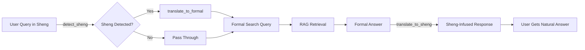

# Sheng Translator Layer - Complete Guide

## 📋 Overview

The **Sheng Translator Layer** is a bidirectional translation system that bridges the gap between Kenyan street slang (Sheng) and formal institutional language. It enables the AmaniQuery RAG system to:

1. **Understand** informal queries from ordinary Kenyans (wanjiku)
2. **Search** using precise formal terms for accurate retrieval
3. **Respond** in the user's original conversational style

---

## 🔄 Translation Flow



### Example Flow

| Step | Content |
|------|---------|
| **1. User Query** | "Kanjo wameamua nini kuhusu parking doh?" |
| **2. Sheng Detection** | ✅ Detected: ["kanjo", "wameamua", "nini", "kuhusu", "doh"] |
| **3. Formal Translation** | "What has the Nairobi City County Government resolved regarding parking fees?" |
| **4. RAG Search** | Retrieves official county resolution documents |
| **5. Formal Answer** | "Nairobi City County has increased parking fees in the Central Business District to KES 300 per day, effective March 1, 2024." |
| **6. Sheng Re-injection** | "Kanjo wameongeza parking fees kwa town centre to KES 300 per day, kutoka March 1, 2024." |

---

## 📚 Sheng Dictionary (120+ Terms)

### Government & Institutions (8 terms)

| Sheng | Formal | Usage |
|-------|--------|-------|
| kanjo | Nairobi City County Government | "Kanjo wameamua..." |
| bunge | Parliament of Kenya | "Bunge wanapanga..." |
| mashamba | County Assembly | "Mashamba ya Nairobi..." |
| serikali | National Government of Kenya | "Serikali inasema..." |
| gavaa | Government | "Gavaa imekataa..." |
| county | County Government | "County wetu..." |
| state house | Office of the President | "State house wamesema..." |

### Political Figures (10 terms)

| Sheng | Formal |
|-------|--------|
| mhesh | Member of Parliament |
| mheshimiwa | Honourable Member of Parliament |
| MCA | Member of County Assembly |
| gavana / gava | Governor |
| rais / prezzo | President |
| DP | Deputy President |
| seneta | Senator |
| wabunge | Members of Parliament |
| mbunge | Member of Parliament |
| viongozi | leaders |

### Money & Finance (10 terms)

| Sheng | Formal | Context |
|-------|--------|---------|
| doh / doe | money | "Parking doh" = parking fees |
| mullah / ganji | money | General money references |
| mbeca / pesa | money | Swahili-origin terms |
| doo | money | "Kutoa doo" = pay money |
| budget | budget allocation | "Budget ya health" |
| taxes | taxation | "Kuongeza taxes" |
| cess | county levy | "Cess ya matatu" |

### Laws & Bills (6 terms)

| Sheng | Formal |
|-------|--------|
| sheria | law |
| bill | proposed legislation |
| act | enacted law |
| katiba | Constitution of Kenya |
| finance bill | Finance Bill |
| amendment | constitutional amendment |

### Locations (10 terms)

| Sheng | Formal |
|-------|--------|
| tao / town | Central Business District |
| CBD | Central Business District |
| mtaa | neighborhood |
| hood | constituency |
| ghetto / slums | informal settlements |
| shags / ocha | rural areas |

### Transport (9 terms)

| Sheng | Formal |
|-------|--------|
| mat / matatu | public service vehicle |
| boda / bodaboda | motorcycle taxi services |
| nduthi | motorcycle |
| gari | vehicle |
| barabara | road |
| jam | traffic congestion |
| traffic | traffic management |

### Services & Infrastructure (12 terms)

| Sheng | Formal |
|-------|--------|
| maji | water services |
| stima / umeme | electricity supply / electrical power |
| wifi | internet connectivity |
| garbage / takataka | solid waste management |
| kanju | Nairobi City County enforcement |
| askari | security officers |
| polisi | Kenya Police Service |

### Healthcare & Education (7 terms)

| Sheng | Formal |
|-------|--------|
| hospital / hospitali | healthcare facility / public hospital |
| shule | educational institution |
| chuo / college | university / tertiary institution |
| daktari | medical practitioner |
| mwalimu | teacher |

### Social Issues (13 terms)

| Sheng | Formal |
|-------|--------|
| uchizi | corruption |
| rushwa | bribery |
| corruption | corruption and economic crimes |
| demo / maandamano | public demonstration / protests |
| protest | public demonstration |
| strikes | industrial action |
| hustler / hustlers | small-scale entrepreneur / ordinary citizens |
| wanjiku | ordinary Kenyan citizen |
| mwananchi / wananchi | citizen / citizens |

### Food & Agriculture (6 terms)

| Sheng | Formal |
|-------|--------|
| chakula | food security |
| unga | maize flour |
| mahindi | maize |
| kilimo | agriculture |
| wakulima | farmers |
| mama mboga | vegetable vendors |

### Housing (5 terms)

| Sheng | Formal |
|-------|--------|
| nyumba | housing |
| plot | residential plot |
| title deed | land title |
| rent / kodi | rental charges / rent payment |

### Employment (5 terms)

| Sheng | Formal |
|-------|--------|
| kazi / job | employment / employment opportunity |
| hustle | income-generating activity |
| biashara | business enterprise |
| duka | retail shop |

### Actions & Common Verbs (15+ terms)

| Sheng | Formal |
|-------|--------|
| wameamua | has resolved |
| wamesema | has stated |
| wanapanga | is planning |
| wanaongeza | is increasing |
| wanapunguza | is reducing |
| wamebadilisha | has changed |
| kupiga kura | voting |
| kura | vote |
| uchaguzi | election |

### Question Words & Connectors (15 terms)

| Sheng | English |
|-------|---------|
| nini | what |
| aje | how |
| lini | when |
| wapi | where |
| nani | who |
| ngapi | how much |
| je | question marker |
| ama / au | or |
| si | isn't it |
| kwani | why |
| bana | emphasis/frustration |
| alafu | and then |
| lakini | but |
| kwa | for/at |
| kuhusu | about/regarding |

---

## 🚀 Quick Start

### 1. Detect Sheng in Query

```python
from Module4_NiruAPI.agents.sheng_translator import detect_sheng

query = "Kanjo wameamua nini kuhusu parking doh?"
is_sheng, confidence, terms = detect_sheng(query)

print(f"Sheng detected: {is_sheng}")  # True
print(f"Confidence: {confidence}")     # 0.75
print(f"Terms: {terms}")                # ['kanjo', 'wameamua', 'nini', 'kuhusu', 'doh']
```

### 2. Translate Sheng → Formal (Dictionary Only)

```python
from Module4_NiruAPI.agents.sheng_translator import translate_to_formal

result = translate_to_formal(
    "Kanjo wameamua nini kuhusu parking doh?",
    use_dictionary_only=True
)

print(result["formal_query"])
# "Nairobi City County Government has resolved what about parking money?"
```

### 3. Translate Sheng → Formal (LLM-Powered)

```python
def my_llm(prompt):
    # Your Gemini/Groq API call
    return "What has the Nairobi City County Government resolved regarding parking fees?"

result = translate_to_formal(
    "Kanjo wameamua nini kuhusu parking doh?",
    llm_function=my_llm
)

print(result["formal_query"])
# "What has the Nairobi City County Government resolved regarding parking fees?"
```

### 4. Translate Formal → Sheng (Response Re-injection)

```python
from Module4_NiruAPI.agents.sheng_translator import translate_to_sheng

result = translate_to_sheng(
    user_query="Kanjo wameamua nini kuhusu parking doh?",
    formal_answer="Nairobi City County has increased parking fees to KES 300 per day.",
    llm_function=my_llm
)

print(result["sheng_response"])
# "Kanjo wameongeza parking fees kwa town to KES 300 per day."
```

### 5. Full Pipeline (All-in-One)

```python
from Module4_NiruAPI.agents.sheng_translator import full_translation_pipeline

def my_rag(formal_query):
    # Your RAG retrieval logic
    return "Nairobi City County increased parking fees to KES 300."

result = full_translation_pipeline(
    user_query="Kanjo wameamua nini kuhusu parking doh?",
    rag_function=my_rag,
    llm_function=my_llm
)

print(result["final_response"])
# Sheng-infused answer that matches user's style
```

---

## 📊 Sheng Detection Algorithm

### Detection Logic

1. **Dictionary Matching**: Searches for known Sheng terms
2. **Pattern Matching**: Uses regex for common Swahili/Sheng patterns
3. **Confidence Scoring**: Based on term density

```python
confidence = min((detected_terms / total_words) * 2, 1.0)
is_sheng = confidence > 0.2  # Threshold: >20% Sheng terms
```

### Confidence Levels

| Confidence | Interpretation | Action |
|------------|----------------|--------|
| **0.8 - 1.0** | Heavy Sheng usage | Always translate |
| **0.5 - 0.79** | Moderate Sheng | Translate recommended |
| **0.2 - 0.49** | Light Sheng | Optional translation |
| **< 0.2** | Minimal/No Sheng | Pass through |

---

## 🎯 Translation Prompts

### Sheng → Formal Prompt

The prompt instructs the LLM to:
- Replace ALL Sheng slang with proper institutional names
- Convert informal phrasing to formal queries
- Preserve original intent
- Remove filler words (bana, si, alafu)
- Expand abbreviations

**Input:** "Kanjo wameamua nini kuhusu parking doh?"  
**Output:** "What has the Nairobi City County Government resolved regarding parking fees?"

### Formal → Sheng Prompt

The prompt instructs the LLM to:
- Use the user's original slang terms
- Keep tone conversational and friendly
- Maintain ALL factual accuracy
- Use short sentences
- Mix Sheng/Swahili/English naturally

**Input (Formal):** "Nairobi City County has increased parking fees in the Central Business District to KES 300 per day, effective March 1, 2024."  
**Output (Sheng):** "Kanjo wameongeza parking fees kwa town centre to KES 300 per day, kutoka March 1, 2024."

---

## 🔌 Integration Examples

### With FastAPI

```python
from fastapi import FastAPI
from pydantic import BaseModel
from Module4_NiruAPI.agents.sheng_translator import full_translation_pipeline

app = FastAPI()

class QueryRequest(BaseModel):
    query: str

@app.post("/query")
async def process_query(request: QueryRequest):
    result = full_translation_pipeline(
        user_query=request.query,
        rag_function=your_rag_function,
        llm_function=your_llm_function
    )
    
    return {
        "answer": result["final_response"],
        "detected_sheng": result["detected_sheng"],
        "pipeline": result["pipeline_steps"]
    }
```

### With Intent Router

```python
from Module4_NiruAPI.agents.intent_router import classify_query
from Module4_NiruAPI.agents.sheng_translator import translate_to_formal, translate_to_sheng

# Step 1: Classify intent
classification = classify_query(user_query, llm_function)

# Step 2: Translate if wanjiku (ordinary citizen)
if classification["query_type"] == "wanjiku":
    translation = translate_to_formal(user_query, llm_function)
    search_query = translation["formal_query"]
else:
    search_query = user_query

# Step 3: RAG retrieval
formal_answer = rag_retrieve(search_query)

# Step 4: Re-inject Sheng for wanjiku
if classification["query_type"] == "wanjiku" and translation["detected_sheng"]:
    response = translate_to_sheng(user_query, formal_answer, llm_function)
    final_answer = response["sheng_response"]
else:
    final_answer = formal_answer
```

### With Gemini Flash

```python
import google.generativeai as genai
from Module4_NiruAPI.agents.sheng_translator import translate_to_formal

genai.configure(api_key="YOUR_KEY")
model = genai.GenerativeModel('gemini-1.5-flash')

def gemini_llm(prompt):
    response = model.generate_content(prompt, temperature=0.2)
    return response.text

result = translate_to_formal(
    "Bunge wanapanga kuongeza tax ya mat ama?",
    llm_function=gemini_llm
)

print(result["formal_query"])
# "Is Parliament planning to increase taxation on public service vehicles?"
```

---

## 🧪 Testing & Examples

### Real-World Test Cases

```python
test_cases = [
    {
        "input": "Kanjo wameamua nini kuhusu parking doh?",
        "expected_formal": "What has Nairobi City County resolved about parking fees?",
        "expected_sheng_response": "Kanjo wameongeza parking fees..."
    },
    {
        "input": "Mheshimiwa wa Starehe alisema aje kuhusu Finance Bill?",
        "expected_formal": "What did the MP for Starehe say about the Finance Bill?",
        "expected_sheng_response": "Mheshimiwa wa Starehe alisema..."
    },
    {
        "input": "Bunge wanapanga kuongeza tax ya mat ama?",
        "expected_formal": "Is Parliament planning to increase PSV taxation?",
        "expected_sheng_response": "Ndio, bunge wanapanga kuongeza tax ya mat..."
    }
]
```

### Run Detection Tests

```bash
cd Module4_NiruAPI/agents
python sheng_translator.py
```

Output:
```
================================================================================
SHENG DETECTION TESTS
================================================================================

Query: "Kanjo wameamua nini kuhusu parking doh?"
  Sheng Detected: True
  Confidence: 0.75
  Terms: kanjo, wameamua, nini, kuhusu, doh

Query: "What did the MP for Starehe say about the Finance Bill?"
  Sheng Detected: False
  Confidence: 0.00
  Terms: None
```

---

## 📈 Performance Considerations

### Dictionary-Only vs LLM Translation

| Method | Latency | Accuracy | Use Case |
|--------|---------|----------|----------|
| **Dictionary Only** | ~5ms | 60-70% | Simple term replacement, testing |
| **LLM (Gemini Flash)** | ~400ms | 90-95% | Production, complex queries |
| **LLM (Groq Llama-3)** | ~250ms | 85-90% | High-volume production |

### Optimization Tips

1. **Use dictionary-only for simple queries** with direct term matches
2. **Cache common translations** to avoid repeated LLM calls
3. **Batch multiple queries** if using paid LLM APIs
4. **Set low temperature** (0.1-0.2) for consistent translations

---

## 🎨 Advanced Features

### Export Dictionary to JSON

```python
from Module4_NiruAPI.agents.sheng_translator import export_dictionary_json

export_dictionary_json("my_sheng_dict.json")
# Dictionary exported to my_sheng_dict.json
```

### Get Dictionary Statistics

```python
from Module4_NiruAPI.agents.sheng_translator import get_dictionary_stats

stats = get_dictionary_stats()
print(f"Total terms: {stats['total_terms']}")  # 120+
print(f"Government terms: {stats['categories']['government']}")
print(f"Money terms: {stats['categories']['money']}")
```

### Custom Dictionary Extension

```python
from Module4_NiruAPI.agents.sheng_translator import SHENG_FORMAL_DICTIONARY

# Add custom terms
SHENG_FORMAL_DICTIONARY.update({
    "kibanda": "roadside kiosk",
    "mkokoteni": "handcart vendor",
    "jua kali": "informal sector artisan"
})
```

---

## ✅ Integration Checklist

- [ ] Sheng translator module imported
- [ ] LLM function configured (Gemini/Groq)
- [ ] Intent router integrated for persona detection
- [ ] RAG pipeline connected
- [ ] Translation tested on sample queries
- [ ] Response style matches user input
- [ ] Logging enabled for translation metrics
- [ ] Fallback logic in place for translation errors

---

## 🚨 Edge Cases & Handling

### Mixed Formal + Sheng

**Input:** "What did mheshimiwa say about Finance Bill bana?"  
**Handling:** Partial translation - replace "mheshimiwa" but keep question structure

### Ambiguous Terms

**Input:** "kwa" can mean "for", "at", or just a connector  
**Handling:** LLM-based translation preserves context better than dictionary

### Regional Variations

**Input:** Some terms vary by region (e.g., "gava" vs "gavana" for Governor)  
**Handling:** Dictionary includes common variations

---

**Built for AmaniQuery Engine v2.0** 🇰🇪  
*Making civic information accessible to all Kenyans, regardless of language*
