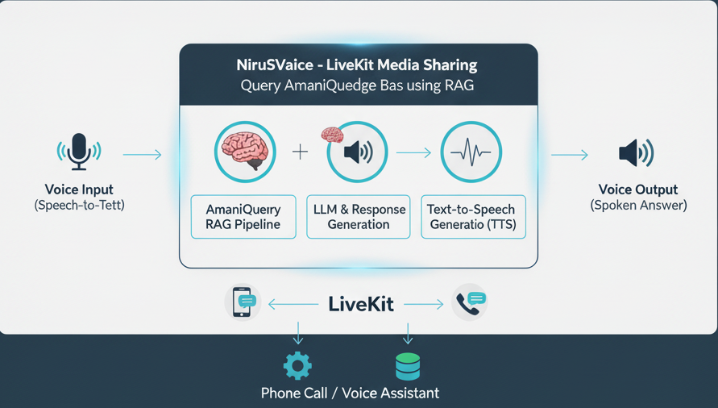
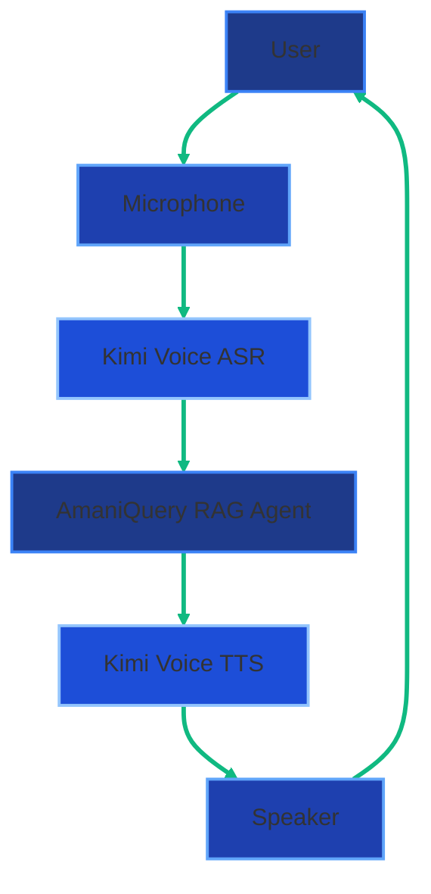

# Module 6: NiruVoice - AmaniQ Voice Agent



This module provides a professional voice agent using LiveKit Agents framework that integrates with AmaniQuery's RAG pipeline to answer voice queries about Kenyan legal, parliamentary, and news intelligence.

## Features

- **Professional Voice Interface**: Clear, authoritative voice responses suitable for legal and policy queries
- **RAG Integration**: Leverages AmaniQuery's existing RAG pipeline for accurate, sourced responses
- **Conversation Context**: Maintains conversation history for multi-turn queries
- **Kimi Voice Integration**: Uses Kimi Voice for high-quality ASR and TTS, with LiveKit as fallback framework
- **Session Management**: Tracks voice sessions with automatic timeout and cleanup (optional Redis persistence)
- **Concise Responses**: Optimized for voice (2-3 minute max response length)
- **Resilience & Error Handling**: Retry logic with exponential backoff, circuit breakers, and graceful error recovery
- **Provider Failover**: Automatic failover between Kimi Voice and LiveKit with health monitoring
- **Performance Optimizations**: Response caching, rate limiting, and connection pooling
- **Monitoring & Observability**: Metrics collection, health checks, and Prometheus integration
- **Scalable Architecture**: Designed for horizontal scaling with distributed session storage

## Architecture

```
Module6_NiruVoice/
├── __init__.py              # Module exports
├── voice_agent.py           # Main LiveKit agent implementation
├── agent_config.py          # Configuration management (with Pydantic validation)
├── stt_tts_handlers.py      # Speech-to-text and text-to-speech handlers
├── rag_integration.py       # Integration with RAG pipeline
├── session_manager.py       # Voice session management (with Redis support)
├── resilience/              # Error handling and resilience
│   ├── retry_handler.py     # Retry logic with exponential backoff
│   ├── circuit_breaker.py   # Circuit breaker pattern
│   └── error_recovery.py    # Error recovery strategies
├── providers/               # Provider management
│   ├── provider_manager.py  # Multi-provider management
│   ├── health_monitor.py    # Provider health monitoring
│   └── fallback_strategy.py # Automatic failover logic
├── monitoring/              # Observability
│   ├── metrics.py           # Metrics collection (Prometheus)
│   ├── health_check.py      # Health check endpoints
│   └── performance_tracker.py # Performance tracking
├── performance/             # Performance optimizations
│   ├── cache.py              # Response caching
│   └── rate_limiter.py       # Rate limiting
├── tests/                   # Test suite
│   ├── test_resilience.py   # Resilience tests
│   └── mocks/               # Mock providers
├── requirements.txt         # Dependencies
└── README.md               # This file
```

## System Architecture Diagram



## Design Inspirations

### Futuristic System Architecture Illustration

A clean, modern, futuristic system architecture diagram of a voice-enabled RAG chatbot in a dark-blue and cyan color palette. Show a central circular flow: User → Microphone → Kimi Voice (ASR) → AmaniQuery RAG Agent → Kimi Voice (TTS) → Speaker → User. Use glowing neon lines, floating holographic icons (mic, brain, document, speaker), subtle Kenyan flag accent colors (green, red, black), minimalistic style, dark background, high-tech UI aesthetic, isometric 3D perspective, professional infographic style --ar 16:9 --v 6 --stylize 250

### African Futurism Lion Illustration

A powerful African futurism illustration: a glowing holographic lion made of legal documents, parliamentary hansards, and news articles floating above Nairobi skyline at night. The lion's eyes emit blue light beams scanning documents. In the foreground, a Retrieval-Augmented Generation pipeline visualized as golden data streams flowing into the lion's mind. Kenyan flag colors subtly integrated, cinematic lighting, ultra-realistic, dramatic, national geographic style --ar 3:2 --v 6 --q 2

### Split-Screen UI Concept

Split-screen futuristic UI: left side shows sound waves entering a glowing AI brain labeled "Kimi-Audio 7B" performing ASR (speech → text), right side shows text transforming into golden sound waves (TTS). Center: a beautiful African woman speaking into a sleek microphone, her voice visualized as colorful African-patterned sound waves. Dark background with electric blue and purple neon accents, cyberpunk aesthetic with Kenyan cultural motifs --ar 16:9 --stylize 300

### Isometric Dashboard Concept

Isometric view of a sleek voice chatbot control center dashboard floating in space. Multiple panels showing: live audio waveform, transcription text, RAG retrieval results, TTS synthesis progress, and playback speaker. All connected by glowing data pipelines. African geometric patterns subtly in background, dark mode UI, Apple-inspired design language, premium tech aesthetic, blue-purple gradient lighting --ar 16:9

### Kimi-Audio 7B Portrait

Epic portrait of the Kimi-Audio 7B-Instruct model as a majestic crystalline AI core floating in space, emitting blue-purple audio waveforms in all directions. African woman's silhouette speaking Swahili/English, her voice transforming into digital tokens entering the core. Moonshot AI logo subtly visible. Cosmic background with Kenyan star constellation, ultra-realistic, cinematic, dramatic lighting --ar 3:2

### ASR Process Infographic

Step-by-step horizontal infographic: 1) African man speaking into phone → 2) Raw waveform → 3) Kimi-Audio processing (glowing brain icon) → 4) Clean transcribed text in Swahili/English. Each step connected by glowing arrows, clean white background with Kenyan color accents, modern flat design, educational illustration style --ar 21:9

### TTS Process Infographic

Reverse of ASR flow: Clean text → Kimi-Audio core → Natural African female voice waveform → Speaker playing response. Show expressive emotion in waveform (happy, confident tone). Same style as above, horizontal educational infographic, white background, Kenyan colors --ar 21:9

## Prerequisites

1. **LiveKit Server**: You need a LiveKit server instance
   - Cloud: Sign up at https://cloud.livekit.io
   - Self-hosted: Follow https://docs.livekit.io/self-hosting/deployment/

2. **API Keys**:
   - LiveKit API credentials (URL, API key, API secret)
   - OpenAI API key (for STT/TTS, if using OpenAI)
   - AssemblyAI API key (optional, if using AssemblyAI for STT)
   - Moonshot/OpenAI/Anthropic API key (for RAG pipeline LLM)

3. **Python Environment**: Python 3.9 or higher

## Installation

1. **Install Dependencies**:

```bash
# Install LiveKit voice agent dependencies
pip install -r Module6_NiruVoice/requirements.txt

# Ensure main project dependencies are installed
pip install -r requirements.txt
```

2. **Configure Environment Variables**:

Create or update your `.env` file with the following:

```bash
# LiveKit Configuration (Required)
LIVEKIT_URL=wss://your-livekit-server.com
LIVEKIT_API_KEY=your_api_key
LIVEKIT_API_SECRET=your_api_secret

# Voice Agent Configuration (Optional - defaults shown)
VOICE_STT_PROVIDER=kimi          # kimi,livekit (comma-separated for multiple)
VOICE_TTS_PROVIDER=kimi          # kimi,livekit (comma-separated for multiple)
VOICE_LANGUAGE=en                  # en or sw (Swahili)
VOICE_MAX_RESPONSE_LENGTH=500      # Maximum words in response
VOICE_ENABLE_FOLLOW_UPS=true      # Enable conversation context
VOICE_CONVERSATION_TIMEOUT=300     # Session timeout in seconds

# Resilience & Error Handling
VOICE_ENABLE_RETRY=true            # Enable retry logic
VOICE_MAX_RETRIES=3                # Maximum retry attempts
VOICE_ENABLE_CIRCUIT_BREAKER=true  # Enable circuit breaker
VOICE_CIRCUIT_BREAKER_THRESHOLD=5  # Circuit breaker failure threshold

# Provider Fallback
VOICE_PROVIDER_FALLBACK_ENABLED=true  # Enable automatic failover
VOICE_FALLBACK_MODE=health_based      # sequential, round_robin, health_based, random

# Performance
VOICE_ENABLE_CACHING=true          # Enable response caching
VOICE_CACHE_TTL=3600               # Cache TTL in seconds
VOICE_ENABLE_RATE_LIMITING=true    # Enable rate limiting
VOICE_RATE_LIMIT_PER_MINUTE=60     # Requests per minute limit

# Session Persistence (Optional)
VOICE_REDIS_SESSIONS=false         # Use Redis for session storage
VOICE_REDIS_URL=redis://localhost:6379  # Redis connection URL

# Monitoring
VOICE_ENABLE_METRICS=true          # Enable metrics collection
VOICE_ENABLE_PROMETHEUS=false      # Enable Prometheus metrics export
VOICE_METRICS_PORT=9090            # Prometheus metrics port

# RAG Pipeline Configuration (Required for RAG to work)
LLM_PROVIDER=moonshot              # moonshot, openai, anthropic
MOONSHOT_API_KEY=your_key          # Or OPENAI_API_KEY, ANTHROPIC_API_KEY
DEFAULT_MODEL=moonshot-v1-8k

# OpenAI API Key (Required if using OpenAI STT/TTS)
OPENAI_API_KEY=your_openai_key

# Optional: AssemblyAI (if using AssemblyAI STT)
ASSEMBLYAI_API_KEY=your_assemblyai_key
```

## Usage

### Development Mode

Run the agent in development mode for testing:

```bash
# From project root
python -m Module6_NiruVoice.voice_agent dev

# Or using the CLI directly
cd Module6_NiruVoice
python voice_agent.py dev
```

This will:
- Start the agent in development mode
- Connect to LiveKit server
- Wait for voice sessions to join

### Production Mode

For production deployment:

```bash
python -m Module6_NiruVoice.voice_agent start
```

### Integration with Frontend

To connect users to the voice agent, you need a frontend that:

1. Connects to the same LiveKit server
2. Joins a room (the agent will automatically join)
3. Handles audio input/output

Example using LiveKit JavaScript SDK:

```javascript
import { Room, RoomEvent } from 'livekit-client';

const room = new Room();
await room.connect(LIVEKIT_URL, token);

// Agent will automatically join and start listening
room.on(RoomEvent.TrackSubscribed, (track, publication, participant) => {
  if (track.kind === 'audio') {
    track.attach(audioElement);
  }
});
```

### Testing with LiveKit Playground

LiveKit provides a playground for testing agents:

1. Start your agent: `python -m Module6_NiruVoice.voice_agent dev`
2. Open LiveKit Playground: https://agents-playground.livekit.io
3. Connect using your LiveKit credentials
4. Start speaking - the agent will respond

## Configuration Options

### STT Providers

- **Kimi Voice** (default): High-quality ASR using Kimi-Audio 7B model
- **LiveKit**: Fallback STT provider with automatic failover

### TTS Providers

- **Kimi Voice** (default): Professional voices using Kimi-Audio 7B model
- **LiveKit**: Fallback TTS provider with automatic failover

### Language Support

- **English (en)**: Primary language, fully supported
- **Swahili (sw)**: Partial support (depends on STT/TTS provider capabilities)

## How It Works

1. **User Speaks**: Audio is captured and sent to LiveKit room
2. **Speech-to-Text**: User's speech is converted to text using Kimi Voice ASR (with LiveKit fallback)
3. **RAG Query**: Text query is processed through AmaniQuery's RAG pipeline
4. **Context Retrieval**: Relevant documents are retrieved from vector database
5. **Response Generation**: LLM generates response based on retrieved context
6. **Voice Formatting**: Response is formatted for natural speech (removes markdown, adds pauses)
7. **Text-to-Speech**: Formatted response is converted to speech using Kimi Voice TTS (with LiveKit fallback)
8. **Audio Output**: Speech is sent back to user through LiveKit room

## Integration with Existing Modules

### Module4_NiruAPI (RAG Pipeline)

The voice agent uses the same RAG pipeline as the REST API:
- Same vector store and embeddings
- Same LLM provider and models
- Consistent responses across voice and text interfaces

### Module3_NiruDB (Vector Store)

Voice queries use the same knowledge base:
- All crawled legal documents
- Parliamentary proceedings
- News articles
- Global trends

## Session Management

The voice agent maintains conversation sessions:
- **Session ID**: Based on LiveKit room name/SID
- **Conversation History**: Last 3 turns for context
- **Timeout**: Sessions expire after 5 minutes of inactivity (configurable)
- **Cleanup**: Expired sessions are automatically removed

## Error Handling

The agent handles various error scenarios:
- **Network Issues**: Graceful degradation with error messages
- **RAG Pipeline Errors**: User-friendly error responses
- **Audio Issues**: Handles unclear audio or connection problems
- **Timeout**: Sessions expire gracefully

## Troubleshooting

### Agent Not Starting

1. Check LiveKit credentials in `.env`
2. Verify LiveKit server is accessible
3. Check Python version (3.9+)
4. Ensure all dependencies are installed

### No Audio Response

1. Check TTS provider API key (OpenAI API key if using OpenAI TTS)
2. Verify RAG pipeline is working (test with REST API first)
3. Check logs for errors

### Poor Speech Recognition

1. Try different STT provider (AssemblyAI vs OpenAI)
2. Check audio quality in LiveKit room
3. Verify language setting matches user's language

### RAG Not Working

1. Ensure vector store is populated with data
2. Check LLM provider API keys
3. Verify RAG pipeline works via REST API endpoint

## Development

### Adding New Features

1. **Custom STT/TTS Providers**: Add handlers in `stt_tts_handlers.py`
2. **Response Formatting**: Modify `rag_integration.py` `_format_for_voice()` method
3. **Session Behavior**: Update `session_manager.py`

### Testing

Test individual components:

```python
# Test RAG integration
from Module6_NiruVoice.rag_integration import VoiceRAGIntegration
rag = VoiceRAGIntegration()
result = rag.query("What is the Kenyan Constitution?")
print(result["text"])

# Test session manager
from Module6_NiruVoice.session_manager import VoiceSessionManager
manager = VoiceSessionManager()
session = manager.create_session("test-session")
```

## Deployment

### Docker

Add to your `docker-compose.yml`:

```yaml
voice-agent:
  build:
    context: .
    dockerfile: Dockerfile.voice
  environment:
    - LIVEKIT_URL=${LIVEKIT_URL}
    - LIVEKIT_API_KEY=${LIVEKIT_API_KEY}
    - LIVEKIT_API_SECRET=${LIVEKIT_API_SECRET}
    # ... other env vars
  command: python -m Module6_NiruVoice.voice_agent start
```

### Cloud Deployment

Deploy to any cloud platform that supports Python:
- **Render**: Add as a background worker
- **Fly.io**: Deploy as a separate app
- **AWS/GCP/Azure**: Use container services

## License

Same license as main AmaniQuery project.

## Support

For issues or questions:
1. Check existing documentation
2. Review logs for error messages
3. Test RAG pipeline independently via REST API
4. Verify LiveKit server connectivity

