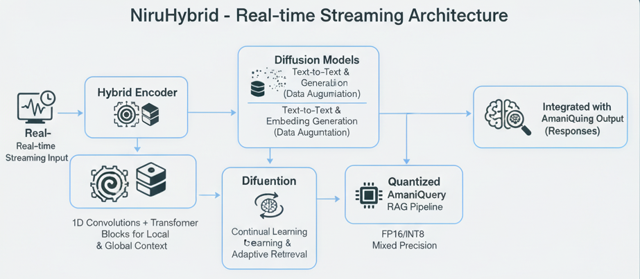

# Module7_NiruHybrid - Hybrid Convolutional-Transformer Pipeline



## Overview

Module7_NiruHybrid provides a hybrid convolutional-transformer architecture integrated with diffusion models for dynamic retention, designed for real-time streaming with quantized attention mechanisms. This module enhances the existing AmaniQuery RAG pipeline with:

- **Hybrid Encoder**: Combines 1D convolutions for local pattern extraction with transformer blocks for global context
- **Diffusion Models**: Text-to-text and text-to-embedding generation for synthetic data augmentation
- **Dynamic Retention**: Continual learning, memory management, and adaptive retrieval
- **Quantized Attention**: FP16/INT8 mixed precision for efficient processing
- **Real-time Streaming**: Optimized for streaming queries and generated data


## Quick Start

### Installation

```bash
# Install dependencies
pip install -r requirements.txt

# Ensure PyTorch is installed (CPU or GPU)
pip install torch torchvision torchaudio
```

### Basic Usage

```python
from Module7_NiruHybrid.integration.rag_integration import HybridRAGPipeline
from Module7_NiruHybrid.hybrid_encoder import HybridEncoder
from Module7_NiruHybrid.config import default_config
from Module4_NiruAPI.rag_pipeline import RAGPipeline

# Initialize base RAG pipeline
base_rag = RAGPipeline()

# Initialize hybrid encoder
hybrid_encoder = HybridEncoder(config=default_config.encoder)

# Create hybrid RAG pipeline
hybrid_rag = HybridRAGPipeline(
    base_rag_pipeline=base_rag,
    hybrid_encoder=hybrid_encoder,
    use_hybrid=True
)

# Query with hybrid encoder
result = hybrid_rag.query(
    query="What does the Kenyan Constitution say about freedom of speech?",
    top_k=5
)

print(result["answer"])
```

## Architecture

### Components

1. **Hybrid Encoder** (`hybrid_encoder.py`)
   - Convolutional blocks for local patterns
   - Transformer blocks with quantized attention
   - Fusion mechanism combining both

2. **Diffusion Models** (`diffusion/`)
   - Text-to-text generation
   - Text-to-embedding generation
   - Training utilities

3. **Retention System** (`retention/`)
   - Continual learning
   - Memory management
   - Adaptive retrieval

4. **Quantization** (`quantization/`)
   - FP16/INT8 mixed precision attention
   - Streaming-optimized attention

5. **Streaming** (`streaming/`)
   - Stream buffer management
   - Real-time processing

6. **Distillation** (`distillation/`)
   - Teacher-Student cascade
   - Knowledge distillation
   - Adaptive retrieval

7. **Integration** (`integration/`)
   - RAG pipeline integration
   - Vector store adapter

## Configuration

See `config.py` for detailed configuration options. Key settings:

- `HybridEncoderConfig`: Encoder architecture parameters
- `QuantizationConfig`: Quantization settings
- `DiffusionConfig`: Diffusion model parameters
- `RetentionConfig`: Retention and learning settings
- `StreamingConfig`: Streaming pipeline settings
- `DistillationConfig`: Teacher-Student cascade settings

## API Endpoints

The module adds the following endpoints to the FastAPI server:

- `POST /query/hybrid` - Hybrid encoder query
- `POST /diffusion/generate` - Generate synthetic documents
- `POST /retention/update` - Trigger retention update
- `POST /stream/query` - Real-time streaming query
- `POST /distillation/cascade` - Distillation cascade query
- `GET /hybrid/stats` - Get pipeline statistics

See [API_REFERENCE.md](API_REFERENCE.md) for detailed API documentation.

## Documentation

- [ARCHITECTURE.md](ARCHITECTURE.md) - Detailed architecture documentation
- [API_REFERENCE.md](API_REFERENCE.md) - API endpoints and usage
- [STREAMING_GUIDE.md](STREAMING_GUIDE.md) - Real-time streaming setup
- [RETENTION_GUIDE.md](RETENTION_GUIDE.md) - Dynamic retention configuration
- [QUANTIZATION_GUIDE.md](QUANTIZATION_GUIDE.md) - Quantization setup and optimization

## Examples

### Using Hybrid Encoder

```python
from Module7_NiruHybrid.hybrid_encoder import HybridEncoder
from Module7_NiruHybrid.config import default_config

encoder = HybridEncoder(config=default_config.encoder)
embeddings = encoder.encode(text="Sample text", return_pooled=True)
```

### Generating Synthetic Documents

```python
from Module7_NiruHybrid.diffusion.text_diffusion import TextDiffusionModel

diffusion = TextDiffusionModel()
generated_text = diffusion.generate(condition="Query context", num_steps=50)
```

### Adaptive Retrieval

```python
from Module7_NiruHybrid.retention.adaptive_retriever import AdaptiveRetriever

retriever = AdaptiveRetriever(
    hybrid_encoder=hybrid_encoder,
    vector_store=vector_store
)
results = retriever.retrieve(query_text="Your query")
```

## Performance

The hybrid pipeline is optimized for:

- **Real-time streaming**: Chunked processing with sliding windows
- **Memory efficiency**: Quantized attention reduces memory usage
- **Adaptive retrieval**: Context-aware document selection
- **Continual learning**: Dynamic model updates from generated data

## Requirements

- Python 3.8+
- PyTorch 2.0+
- transformers 4.30+
- bitsandbytes 0.41+ (for quantization)
- accelerate 0.20+ (for mixed precision)

See `requirements.txt` for complete list.

## License

MIT License - See LICENSE file

