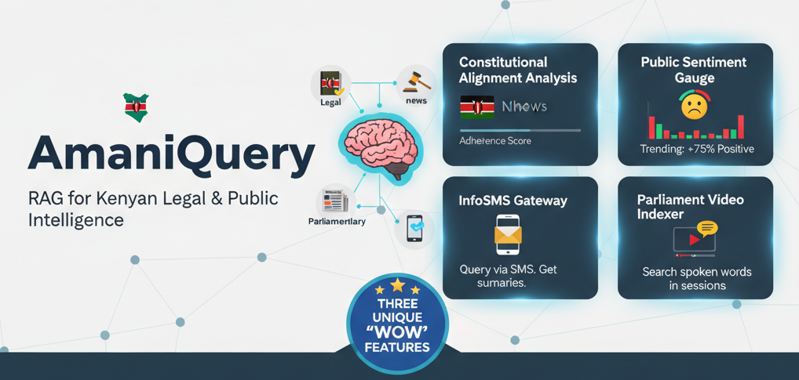
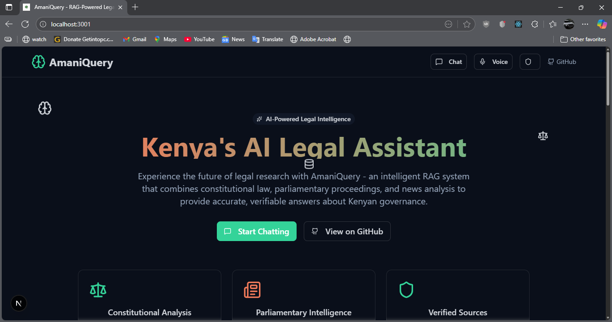
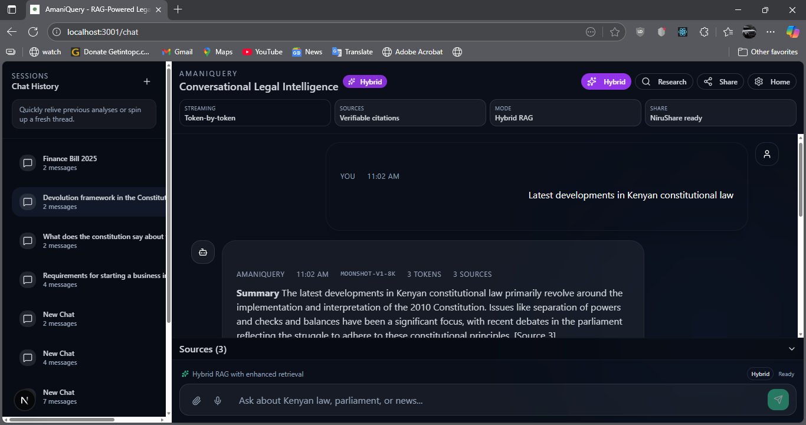
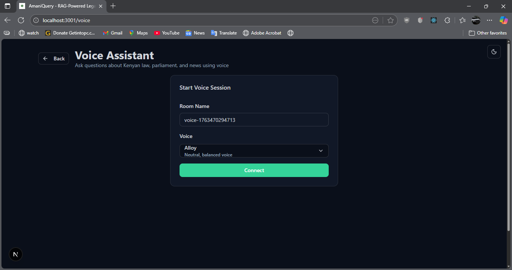
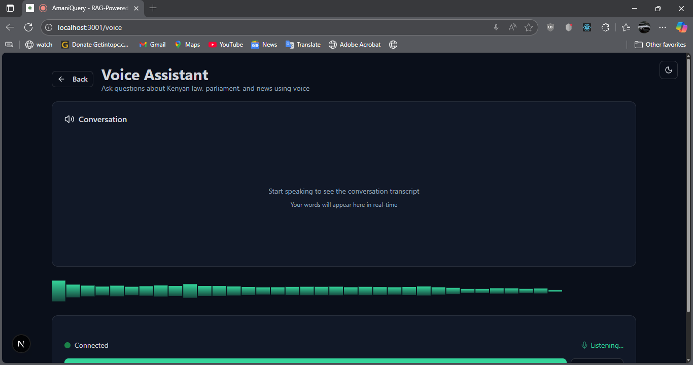
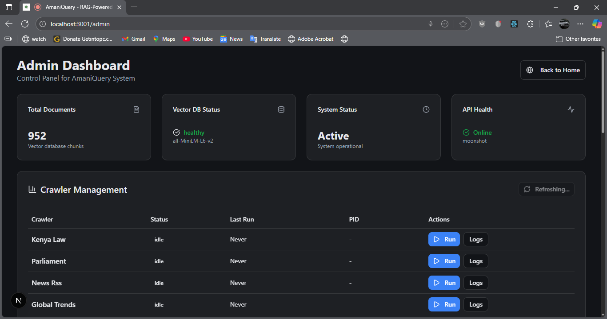
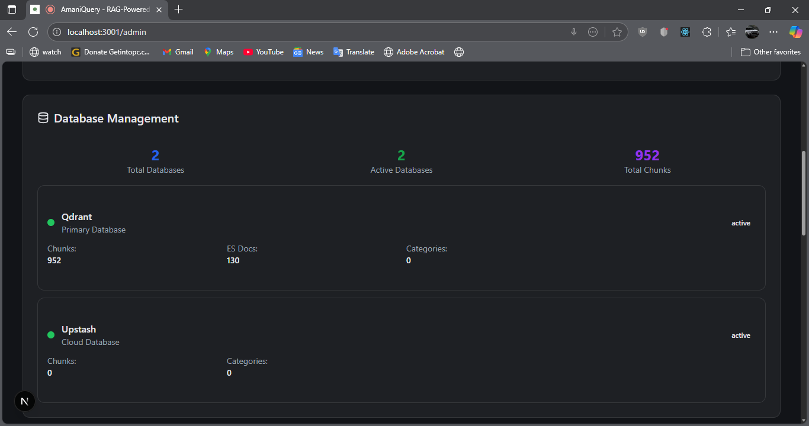
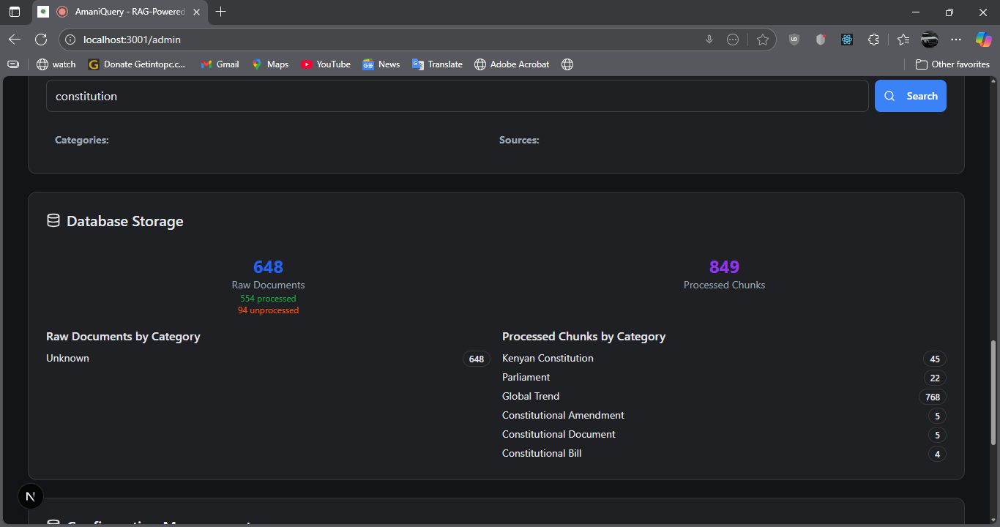
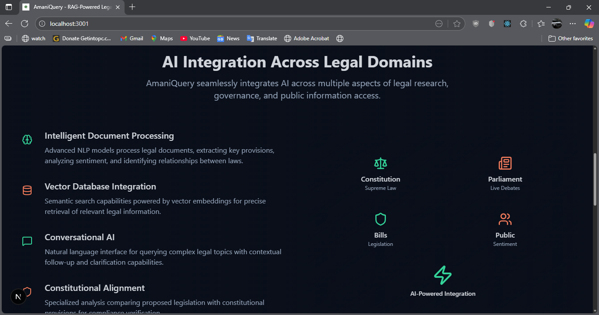

# AmaniQuery 🇰🇪



A Retrieval-Augmented Generation (RAG) system for Kenyan legal, parliamentary, and news intelligence with **three unique "wow" features**: Constitutional Alignment Analysis, Public Sentiment Gauge, InfoSMS Gateway, and Parliament Video Indexer.

## 🌟 Unique Features

### 1. 📊 Public Sentiment Gauge

**Track public sentiment on trending topics from news coverage**

- Sentiment analysis on all news articles (positive/negative/neutral)
- Real-time aggregation by topic with percentage breakdowns
- Visual sentiment distribution for policies, bills, and events
- Example: "Finance Bill: 70% negative, 20% neutral, 10% positive"

```bash
GET /sentiment?topic=Finance%20Bill&days=30
```

### 2. 📱 InfoSMS Gateway (Kabambe Accessibility)

**SMS-based queries for feature phone users**

- 160-character intelligent responses via SMS
- English and Swahili language support
- Africa's Talking integration for Kenya
- Automatic query type detection (legal/parliament/news)
- Works on feature phones without internet

```bash
User SMS: "Finance Bill"
AmaniQuery: "Finance Bill 2025 raises revenue through digital service tax..."
```

### 3. 🎥 Parliament Video Indexer

**Searchable YouTube transcripts with timestamp citations**

- Automatic transcript extraction from Parliament YouTube channels
- Timestamp-based citations (jump to exact moment)
- 60-second chunks with contextual overlap
- Vector search for semantic matching
- Direct YouTube links with `&t=XXs` parameters

```bash
Query: "budget allocation for education"
Response: "At 15:42 in the Finance Committee session..."
Link: https://youtube.com/watch?v=abc123&t=942s
```

### 4. ⚖️ Constitutional Alignment Analysis

**Compare Bills and Acts against the Constitution**

- Dual-retrieval RAG system (Bill + Constitution chunks separately)
- Granular legal metadata extraction (articles, clauses)
- Structured comparative analysis with citations
- Quick-check endpoint for specific constitutional topics

## 🏛️ Architecture

AmaniQuery is built as an 8-module pipeline:

1. **[NiruSpider](Module1_NiruSpider/README.md)** - Web crawler for data ingestion
2. **[NiruParser](Module2_NiruParser/README.md)** - ETL pipeline with embedding generation
3. **[NiruDB](Module3_NiruDB/README.md)** - Vector database with metadata storage
4. **[NiruAPI](Module4_NiruAPI/README.md)** - RAG-powered query interface with multi-model support
5. **[NiruShare](Module5_NiruShare/README.md)** - Social media sharing service
6. **[NiruVoice](Module6_NiruVoice/README.md)** - Voice agent for real-time conversations
7. **[NiruHybrid](Module7_NiruHybrid/README.md)** - Enhanced RAG with hybrid encoder and adaptive retrieval
8. **[NiruAuth](Module8_NiruAuth/README.md)** - Authentication and authorization system for users and third-party integrations

## 📸 Screenshots

### Homepage



### Chat Interface



### Voice Agent




### Admin Dashboard





### AI Integration



## 📚 Documentation

**Comprehensive documentation is available:**

- **[📖 Documentation Index](./docs/DOCUMENTATION_INDEX.md)** - Central navigation hub with organized paths for different user roles
- **[🚀 Quick Start Guide](./QUICKSTART.md)** - Detailed installation instructions
- **[🏗️ Architecture Docs](./docs)** - System design and module documentation

### Documentation by Role

| Role | Start With | Key Docs |
|------|------------|----------|
| **End Users** | [Main Features](#-unique-features) | [InfoSMS Guide](./docs/SHARING_GUIDE.md) |
| **Developers** | [📖 Documentation Index](./docs/DOCUMENTATION_INDEX.md) | [Module READMEs](./Module1_NiruSpider/README.md) |
| **DevOps** | [Deployment Guide](./docs/DEPLOYMENT_GUIDE.md) | [Docker/K8s Docs](./docs) |
| **Contributors** | [Contributing Guide](./CONTRIBUTING.md) | [Architecture Docs](./docs/AMANIQ_V2_ARCHITECTURE.md) |

## 🚀 Quick Start

See the [Quick Start Guide](./QUICKSTART.md) for detailed installation instructions.

**tl;dr:**

```bash
# 1. Setup environment
python setup.py

# 2. Run API (includes all modules)
python start_api.py
```

For detailed module-specific instructions, see [📖 Documentation Index](./docs/DOCUMENTATION_INDEX.md).

- Authentication system (Module 8, if `ENABLE_AUTH=true`)
- All API endpoints

### 4. Initialize Authentication (Optional)

If you want to enable authentication:

```bash
# Run database migration for auth tables
python migrate_auth_db.py

# Set environment variable
ENABLE_AUTH=true
```

See [NiruAuth README](Module8_NiruAuth/README.md) for detailed setup instructions.

### 4. Query and Share

```python
import requests

# Standard query
response = requests.post("http://localhost:8000/query", json={
    "query": "What does the Constitution say about freedom of expression?"
})
result = response.json()

# Streaming query (real-time token-by-token)
response = requests.post("http://localhost:8000/query/stream", json={
    "query": "What does the Constitution say about freedom of expression?",
    "top_k": 5,
    "include_sources": True
}, stream=True)

for line in response.iter_lines():
    if line:
        print(line.decode('utf-8'))

# Hybrid RAG query (enhanced retrieval)
response = requests.post("http://localhost:8000/query/hybrid", json={
    "query": "What does the Constitution say about freedom of expression?",
    "top_k": 5,
    "use_hybrid": True
})
result = response.json()

# Share to Twitter
share = requests.post("http://localhost:8000/share/format", json={
    "answer": result["answer"],
    "sources": result["sources"],
    "platform": "twitter",
    "query": "Constitutional rights"
})
print(share.json()["content"])
```

## 🎯 Data Sources

### Kenyan Laws & Constitution

- **Source**: <https://new.kenyalaw.org/>
- **Strategy**: Comprehensive crawl + periodic updates
- **Content**:
  - Constitution of Kenya 2010 (article-level)
  - Acts of Parliament (500+ acts, section-level)
  - Bills (all types)
  - Subsidiary & County Legislation
  - Case Law & Judgments (300k+ decisions, all courts)
  - Kenya Gazette (8,000+ gazettes, 1899-2025)
  - Treaties & International Agreements
  - Legal Publications & Journals
  - Daily Cause Lists

### Parliament

- **Source**: <https://www.parliament.go.ke/>
- **Strategy**: Weekly crawl
- **Content**: Hansards, Bills, Publications

### Kenyan News (High-Frequency)

- **Sources**:
  - nation.africa/rss
  - standardmedia.co.ke/rss
  - the-star.co.ke/rss
  - businessdailyafrica.com/rss
- **Strategy**: Daily RSS feed parsing

### Global News & International Affairs

- **Sources**:
  - Geopolitics: Reuters, BBC, Al Jazeera, Foreign Policy
  - International Organizations: UN, WHO, World Bank, IMF, African Union
  - Technology: Reuters Tech, TechCrunch, MIT Tech Review
  - Policy: The Economist, Brookings, CFR
  - Climate & Development: UN Climate, UNDP
- **Strategy**: Daily RSS feed parsing
- **Focus**: Africa-relevant global news, international policy, institutional announcements

## 🚀 Features

### Core Features

- ✅ Automated web crawling from Kenyan sources
- ✅ Intelligent text processing & chunking
- ✅ Vector embeddings for semantic search
- ✅ RAG-powered Q&A with multi-model support (OpenAI, Moonshot, Anthropic, Gemini)
- ✅ **Real-time streaming responses** - Token-by-token generation for faster perceived speed
- ✅ **Multi-model ensemble** - When context is limited, queries all available models and combines responses for accuracy
- ✅ **Hybrid RAG Pipeline** - Enhanced retrieval with hybrid encoder and adaptive retrieval
- ✅ Source citation & verification
- ✅ REST API with interactive documentation

### Unique Differentiators

- ✅ **Public Sentiment Gauge** - Track news sentiment by topic
- ✅ **InfoSMS Gateway** - SMS queries via Africa's Talking (kabambe accessibility)
- ✅ **Parliament Video Indexer** - Searchable YouTube transcripts with timestamps
- ✅ **Constitutional Alignment Analysis** - Dual-retrieval Bill-Constitution comparison
- ✅ **Vision RAG** - Multimodal RAG with Cohere Embed-4 and Gemini 2.5 Flash for image/PDF analysis
- ✅ **Social media sharing** - Intelligent formatting for Twitter/X, LinkedIn, Facebook
- ✅ **Chat interface** - Modern, responsive UI with copy/edit/resend for failed queries
- ✅ **Voice agent** - Real-time voice conversations via VibeVoice
- ✅ **Authentication & Authorization** - User accounts, API keys, OAuth 2.0, RBAC, rate limiting, usage tracking

## 🧠 RAG Pipeline

### Standard RAG

1. **Chunking**: 500-1000 characters with 100-char overlap
2. **Embedding Model**: all-MiniLM-L6-v2
3. **Vector DB**: ChromaDB / FAISS / Upstash / Qdrant
4. **LLM**: Moonshot AI (default), OpenAI, Anthropic, Gemini

### Enhanced Features

#### Multi-Model Ensemble

When context is limited or unavailable in vector storage, AmaniQuery automatically:

- Queries all available models (OpenAI, Moonshot, Anthropic, Gemini) in parallel
- Combines responses intelligently to remove redundancy
- Streams the synthesized response for better accuracy

#### Hybrid RAG (Module 7)

- **Hybrid Encoder**: Combines convolutional and transformer architectures for enhanced embeddings
- **Adaptive Retrieval**: Multi-stage retrieval with context-aware thresholds
- **Streaming Support**: Optimized for real-time token-by-token responses
- **Improved Response Format**: Concise, scannable responses with clear structure

#### Response Formatting

- **Concise structure**: Summary → Key Points → Important Details
- **Better readability**: Proper spacing, bullet points, limited section length
- **No redundant disclaimers**: Only cites sources when directly used

## 📊 Feature Details

### Public Sentiment Gauge

Analyze news sentiment on any topic:

```python
# Get sentiment breakdown
GET /sentiment?topic=Finance%20Bill&days=30

# Response
{
  "sentiment_percentages": {
    "positive": 15.0,
    "negative": 70.0,
    "neutral": 15.0
  },
  "average_polarity": -0.35,
  "total_articles": 20
}
```

**Use Cases:**

- Track public reaction to legislation
- Monitor news tone on policies
- Identify controversial topics
- Compare Kenyan vs Global coverage sentiment

### InfoSMS Gateway

Query AmaniQuery via SMS (no internet needed):

```python
# Webhook for incoming SMS
POST /sms-webhook

# Preview SMS response (testing)
GET /sms-query?query=Finance%20Bill&language=en

# Manual SMS send
POST /sms-send?phone_number=+254712345678&message=...
```

**Setup:**

1. Sign up at <https://africastalking.com>
2. Set environment variables: `AT_USERNAME`, `AT_API_KEY`
3. Configure webhook URL in Africa's Talking dashboard
4. Users send SMS to your shortcode

**Features:**

- 160-character concise responses
- English and Swahili support
- ~KES 0.80 per SMS in Kenya
- Feature phone accessibility (kabambe)

### Parliament Video Indexer

Search Parliament YouTube videos with timestamp citations:

```python
# Search videos
POST /query
{
  "query": "budget allocation for education",
  "category": "Parliamentary Record"
}

# Response includes timestamp URLs
{
  "sources": [{
    "title": "Finance Committee Session",
    "timestamp_url": "https://youtube.com/watch?v=abc&t=942s",
    "timestamp_formatted": "15:42",
    "excerpt": "Budget allocation discussion..."
  }]
}
```

**How it works:**

1. Spider scrapes Parliament YouTube channels
2. youtube-transcript-api extracts transcripts with timestamps
3. 60-second chunks with 10-second overlap
4. Each chunk indexed with `start_time_seconds`
5. Citations include YouTube links with `&t=XXs` parameter

## 🏛️ Constitutional Alignment Module

AmaniQuery's **core legal feature**: Dual-retrieval RAG for constitutional compliance analysis.

**How it works:**

1. Analyzes query to identify Bill and constitutional concepts
2. Retrieves Bill chunks (filtered by `category='Bill'`)
3. Retrieves Constitution chunks (filtered by `category='Constitution'`)
4. Generates structured comparative analysis with citations

**Example:**

```python
response = requests.post("http://localhost:8000/alignment-check", json={
    "query": "How does the Finance Bill housing levy align with the constitution?"
})

# Returns structured analysis:
# 1. The Bill's Proposal (with citations)
# 2. Relevant Constitutional Provisions
# 3. Alignment Analysis (objective comparison)
# 4. Key Considerations
```

**API Endpoints:**

- `POST /alignment-check` - Full constitutional alignment analysis
- `POST /alignment-quick-check` - Quick bill vs concept check

See [Constitutional Alignment Guide](docs/CONSTITUTIONAL_ALIGNMENT.md) for details.

## Documentation

- `GET /docs` - Interactive API documentation (Swagger UI)
- `GET /redoc` - Alternative documentation (ReDoc)

## �📱 Social Media Sharing

Module 5 provides intelligent formatting for:

- **Twitter/X**: Auto-threading for long content (280 char limit)
- **LinkedIn**: Professional posts with key takeaways (3000 char)
- **Facebook**: Engaging posts with call-to-action

See [Sharing Guide](docs/SHARING_GUIDE.md) for details.

## 📊 Metadata Structure

Each chunk stores:

- `source_url`: Original article/document URL
- `title`: Document title
- `publication_date`: ISO format date
- `category`: ["Kenyan Law", "Parliament", "Kenyan News", "Global Trend"]
- `chunk_id`: Unique identifier (e.g., article-xyz_chunk_3)
- `author`: When available
- `summary`: Auto-generated snippet

## 🔧 Configuration

Edit `config/sources.yaml` to:

- Add/remove data sources
- Adjust crawl schedules
- Configure chunk sizes
- Set embedding parameters

## 📅 Automated Scheduling

Use Windows Task Scheduler or cron (Linux):

```bash
# Daily news crawl at 6 AM
# Weekly parliament crawl on Mondays
# Monthly law database update
```

See `scripts/scheduler_setup.md` for details.

## 🛡️ Ethical Crawling

- Respects `robots.txt`
- 2-3 second delays between requests
- User-agent identification
- Rate limiting on RSS feeds

## 📚 Documentation

- [Quick Start Guide](QUICKSTART.md) - Step-by-step setup
- [Constitutional Alignment](docs/CONSTITUTIONAL_ALIGNMENT.md) - **Core feature guide**
- [Moonshot AI Setup](docs/MOONSHOT_SETUP.md) - LLM configuration
- [Social Media Sharing](docs/SHARING_GUIDE.md) - Sharing guide
- [Authentication System](Module8_NiruAuth/README.md) - **Auth module guide**
- [Email Setup](Module8_NiruAuth/README_EMAIL_SETUP.md) - Gmail SMTP configuration
- [API Documentation](http://localhost:8000/docs) - Interactive docs

## 💡 Use Cases

- 📚 Legal research & constitutional queries
- ⚖️ **Constitutional alignment analysis** (Bills vs Constitution)
- 🏛️ Parliamentary proceedings analysis
- 📰 News aggregation & summarization
- 🌍 Policy & global trend tracking
- 📱 Social media content creation
- 🎓 Educational resource for Kenyan civics
- 💼 Legislative due diligence
- 💬 **Real-time chat interface** - Interactive Q&A with streaming responses
- 🎤 **Voice queries** - Ask questions via voice (VibeVoice integration)
- 🔄 **Multi-model accuracy** - Enhanced responses when context is limited
- 📊 **Hybrid retrieval** - Improved accuracy with adaptive retrieval
- 🔐 **Third-party integrations** - API keys and OAuth 2.0 for external applications
- 📊 **Usage analytics** - Track API usage and costs for integrations

## �📝 License

Apache License 2.0 - See LICENSE file

## 🤝 Contributing

All contributions are welcome! Refer to the [CONTRIBUTING.md](CONTRIBUTING.md) file for details.

---
