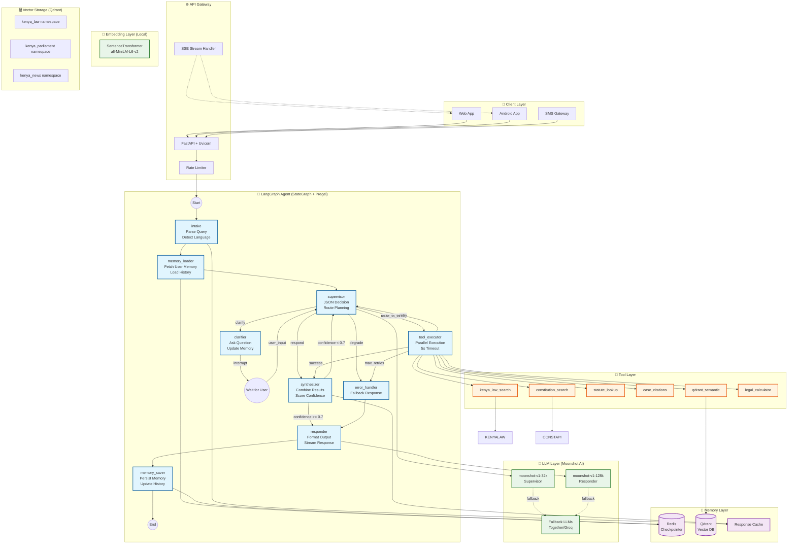

# AmaniQ v2 LangGraph Architecture

> **Principal Engineer Spec** | Production-Ready for 5,000+ Daily Active Kenyan Users  
> Target: 1,000+ concurrent users on $40/mo Johannesburg server | p99 latency <3.5s

---

## 1. Executive Summary

AmaniQ v2 is a Kenyan legal research agent built on **LangGraph (StateGraph + Pregel)** with:
- **Persistent RedisCheckpointer** for crash recovery
- **Conversational memory** for multi-turn context retention
- **Moonshot AI** as the default LLM provider (cost-effective for emerging markets)
- **Parallel tool execution** with 5s timeouts
- **Graceful degradation** when Kenya Law Reports is down

---

## 2. Full Typed AgentState Schema

```python
from typing import Annotated, TypedDict, Literal, Optional, List, Dict, Any
from datetime import datetime
from operator import add
from langgraph.graph.message import add_messages
from langchain_core.messages import BaseMessage

# ============================================================================
# MEMORY SCHEMAS
# ============================================================================

class ConversationMemory(TypedDict):
    """Short-term: Current session context"""
    session_id: str
    user_id: str
    started_at: datetime
    messages: Annotated[List[BaseMessage], add_messages]
    turn_count: int
    topic_summary: str  # Rolling summary of conversation topic

class LongTermMemory(TypedDict):
    """Long-term: Cross-session user knowledge"""
    user_id: str
    frequently_asked_topics: List[str]  # e.g., ["land law", "employment"]
    past_queries: List[Dict[str, Any]]  # Last 50 queries with timestamps
    preferred_citation_format: str  # "full" | "short" | "academic"
    jurisdiction_preferences: List[str]  # ["Kenya", "EAC"]
    expertise_level: Literal["citizen", "paralegal", "advocate"]
    last_active: datetime

class WorkingMemory(TypedDict):
    """Scratchpad for current reasoning chain"""
    current_hypothesis: Optional[str]
    gathered_facts: Annotated[List[str], add]
    pending_clarifications: List[str]
    confidence_score: float  # 0.0 - 1.0

# ============================================================================
# TOOL EXECUTION SCHEMAS
# ============================================================================

class ToolCall(TypedDict):
    """Single tool invocation request"""
    tool_name: str
    tool_id: str  # UUID for tracking
    arguments: Dict[str, Any]
    priority: int  # 1-5, lower = higher priority
    timeout_ms: int  # Default 5000

class ToolResult(TypedDict):
    """Single tool execution result"""
    tool_id: str
    tool_name: str
    status: Literal["success", "timeout", "error", "degraded"]
    result: Optional[Any]
    error_message: Optional[str]
    latency_ms: int
    cached: bool
    timestamp: datetime

# ============================================================================
# SUPERVISOR STRUCTURED OUTPUT
# ============================================================================

class SupervisorDecision(TypedDict):
    """Supervisor MUST output this JSON schema only"""
    reasoning: str  # Chain-of-thought (max 200 chars)
    action: Literal[
        "route_to_tools",      # Execute tools in parallel
        "clarify",             # Ask user for clarification
        "respond",             # Generate final response
        "retry_tools",         # Retry failed tools
        "degrade_gracefully",  # Use cached/fallback data
        "escalate"             # Human handoff (future)
    ]
    selected_tools: Optional[List[str]]  # Tool names if action == route_to_tools
    clarification_question: Optional[str]  # If action == clarify
    confidence: float  # 0.0 - 1.0
    should_cache_response: bool
    memory_update: Optional[Dict[str, Any]]  # Updates to long-term memory

# ============================================================================
# SOURCE AND CITATION SCHEMAS
# ============================================================================

class LegalSource(TypedDict):
    """Standardized legal source reference"""
    source_type: Literal["case", "statute", "regulation", "article", "constitution"]
    title: str
    citation: str  # e.g., "[2019] eKLR"
    year: Optional[int]
    court: Optional[str]
    url: Optional[str]
    relevance_score: float
    snippet: str  # Relevant excerpt (max 500 chars)

# ============================================================================
# MAIN AGENT STATE
# ============================================================================

class AgentState(TypedDict):
    """
    Complete state for AmaniQ v2 LangGraph agent.
    Persisted to Redis via RedisCheckpointer.
    """
    # === IDENTIFIERS ===
    thread_id: str  # Conversation thread UUID
    user_id: str  # User identifier for memory lookup
    request_id: str  # Current request UUID (for tracing)
    
    # === MEMORY LAYERS ===
    conversation_memory: ConversationMemory  # Session context
    long_term_memory: LongTermMemory  # Cross-session knowledge
    working_memory: WorkingMemory  # Current reasoning scratchpad
    
    # === MESSAGE HISTORY ===
    messages: Annotated[List[BaseMessage], add_messages]  # Full message history
    
    # === CURRENT REQUEST ===
    original_query: str  # User's original question
    reformulated_query: Optional[str]  # After clarification/expansion
    query_language: Literal["en", "sw"]  # English or Swahili
    query_intent: Optional[str]  # Classified intent
    query_entities: List[Dict[str, str]]  # Extracted entities
    
    # === SUPERVISOR STATE ===
    supervisor_decision: Optional[SupervisorDecision]
    current_phase: Literal[
        "intake",           # Initial query processing
        "planning",         # Supervisor deciding action
        "tool_execution",   # Parallel tool calls
        "clarification",    # Waiting for user input
        "synthesis",        # Combining results
        "response",         # Generating output
        "complete"          # Done
    ]
    iteration_count: int  # Tracks cycles (max 5)
    
    # === TOOL EXECUTION ===
    pending_tool_calls: List[ToolCall]
    tool_results: Annotated[List[ToolResult], add]  # Accumulates results
    failed_tools: List[str]  # Tools that failed this cycle
    
    # === RESEARCH RESULTS ===
    sources: Annotated[List[LegalSource], add]  # Accumulated sources
    synthesized_answer: Optional[str]
    citations: List[str]
    
    # === RESILIENCE ===
    kenya_law_available: bool  # Health check result
    fallback_mode: bool  # Using degraded data
    cache_hits: int
    
    # === TIMING ===
    started_at: datetime
    last_checkpoint: datetime
    total_latency_ms: int
    
    # === ERROR HANDLING ===
    errors: Annotated[List[str], add]
    retry_count: int  # Max 3
    should_terminate: bool
```

---

## 3. Node List and Responsibilities

### 3.1 Core Nodes (9 Total)

| Node | Responsibility | Timeout | Retry | Cacheable |
|------|---------------|---------|-------|-----------|
| **`intake`** | Parse query, detect language (en/sw), extract entities, load user memory | 500ms | No | No |
| **`memory_loader`** | Fetch long-term memory from Redis, inject into state | 300ms | Yes (1x) | Yes (5min) |
| **`supervisor`** | Decide next action via structured JSON output | 1000ms | Yes (2x) | No |
| **`tool_executor`** | Execute tools in parallel with 5s timeout each | 5000ms | Per-tool | Per-tool |
| **`clarifier`** | Generate clarification question, update working memory | 800ms | No | No |
| **`synthesizer`** | Combine tool results into coherent answer | 1500ms | Yes (1x) | Yes (1hr) |
| **`responder`** | Format final response with citations, update memory | 1000ms | No | No |
| **`memory_saver`** | Persist conversation summary and long-term memory updates | 500ms | Yes (2x) | No |
| **`error_handler`** | Graceful degradation, fallback responses | 300ms | No | No |

### 3.2 Node Details

#### `intake` Node
```
Inputs: raw user message, thread_id, user_id
Outputs: original_query, query_language, query_entities, query_intent
Side Effects: None
```
- Detects Swahili vs English using fasttext-langdetect
- Extracts legal entities (case names, statute references, dates)
- Classifies intent: `factual_lookup`, `case_search`, `legal_advice`, `document_draft`, `clarification`

#### `memory_loader` Node
```
Inputs: user_id, thread_id
Outputs: long_term_memory, conversation_memory (previous messages)
Side Effects: Redis read
```
- Loads last 50 queries from user history
- Injects relevant past context into working memory
- Caches memory load for 5 minutes

#### `supervisor` Node
```
Inputs: Full AgentState
Outputs: SupervisorDecision (structured JSON ONLY)
Side Effects: None
```
- **MUST output structured JSON** - no free-form text
- Decides: route_to_tools | clarify | respond | retry_tools | degrade_gracefully
- Tracks iteration count (max 5 cycles)
- Updates confidence score based on tool results

#### `tool_executor` Node
```
Inputs: pending_tool_calls
Outputs: tool_results, failed_tools
Side Effects: External API calls
```
- **Parallel execution** via asyncio.gather with 5s timeout per tool
- Tools wrapped in retry decorator (2 attempts)
- Graceful degradation: returns cached/stale data on failure
- Emits streaming events for real-time UI updates

#### `clarifier` Node
```
Inputs: supervisor_decision.clarification_question, working_memory
Outputs: clarification message, updated working_memory
Side Effects: None
```
- Generates targeted clarification questions
- Stores pending clarifications in working memory
- Limits to 2 clarification rounds per conversation

#### `synthesizer` Node
```
Inputs: tool_results, sources, working_memory
Outputs: synthesized_answer, citations, confidence_score
Side Effects: None
```
- Combines results from multiple tools
- Deduplicates sources
- Generates structured citations
- Scores answer confidence

#### `responder` Node
```
Inputs: synthesized_answer, citations, user preferences
Outputs: final formatted response
Side Effects: Streaming output
```
- Formats response based on user expertise level
- Adds appropriate disclaimers for legal advice
- Streams response in chunks

#### `memory_saver` Node
```
Inputs: conversation summary, long-term memory updates
Outputs: None
Side Effects: Redis write
```
- Updates conversation summary (rolling)
- Persists frequently asked topics
- Saves successful query patterns

#### `error_handler` Node
```
Inputs: errors, failed_tools, fallback_mode
Outputs: degraded response or error message
Side Effects: Logging
```
- Provides cached responses when Kenya Law is down
- Returns helpful error messages in Swahili/English
- Logs errors for monitoring

---

## 4. Complete Routing Table

### 4.1 Conditional Edges

```
┌─────────────────────────────────────────────────────────────────────────────┐
│                        ROUTING TABLE                                         │
├──────────────────┬──────────────────────────────────────────────────────────┤
│ FROM             │ TO (CONDITIONS)                                           │
├──────────────────┼──────────────────────────────────────────────────────────┤
│ START            │ → intake                                                  │
├──────────────────┼──────────────────────────────────────────────────────────┤
│ intake           │ → memory_loader                                           │
├──────────────────┼──────────────────────────────────────────────────────────┤
│ memory_loader    │ → supervisor                                              │
├──────────────────┼──────────────────────────────────────────────────────────┤
│ supervisor       │ → tool_executor    IF action == "route_to_tools"          │
│                  │ → clarifier        IF action == "clarify"                 │
│                  │ → synthesizer      IF action == "respond"                 │
│                  │ → tool_executor    IF action == "retry_tools"             │
│                  │ → error_handler    IF action == "degrade_gracefully"      │
│                  │ → responder        IF action == "escalate"                │
├──────────────────┼──────────────────────────────────────────────────────────┤
│ tool_executor    │ → supervisor       IF any(failed_tools) AND retry < 3     │
│                  │ → synthesizer      IF all tools succeeded                 │
│                  │ → error_handler    IF retry >= 3                          │
├──────────────────┼──────────────────────────────────────────────────────────┤
│ clarifier        │ → __interrupt__    (WAIT FOR USER INPUT)                  │
│                  │ → supervisor       (AFTER USER RESPONDS)                  │
├──────────────────┼──────────────────────────────────────────────────────────┤
│ synthesizer      │ → supervisor       IF confidence < 0.7 AND iter < 5       │
│                  │ → responder        IF confidence >= 0.7 OR iter >= 5      │
├──────────────────┼──────────────────────────────────────────────────────────┤
│ responder        │ → memory_saver                                            │
├──────────────────┼──────────────────────────────────────────────────────────┤
│ memory_saver     │ → END                                                     │
├──────────────────┼──────────────────────────────────────────────────────────┤
│ error_handler    │ → responder        (degraded response)                    │
└──────────────────┴──────────────────────────────────────────────────────────┘
```

### 4.2 Cycles (Explicit)

1. **Reasoning Cycle**: `supervisor → tool_executor → supervisor`
   - Allows multi-step research (up to 5 iterations)
   - Supervisor reviews results and decides if more tools needed

2. **Clarification Cycle**: `supervisor → clarifier → [user input] → supervisor`
   - Supports up to 2 clarification rounds
   - User input re-enters at supervisor for re-planning

3. **Confidence Cycle**: `synthesizer → supervisor → tool_executor → synthesizer`
   - Triggers when answer confidence < 0.7
   - Gathers additional sources

4. **Retry Cycle**: `tool_executor → supervisor → tool_executor`
   - Retries failed tools up to 3 times
   - Falls back to degraded mode after

---

## 5. Recommended Models

### 5.1 Model Selection (Moonshot AI Default)

| Role | Model | Context | Reason |
|------|-------|---------|--------|
| **Supervisor** | `moonshot-v1-32k` | 32K tokens | Structured JSON output, fast routing decisions |
| **Responder** | `moonshot-v1-128k` | 128K tokens | Long legal documents, comprehensive answers |
| **Embeddings** | `all-MiniLM-L6-v2` (SentenceTransformer) | 384 dims | Local embeddings via VectorStore - no API calls |
| **Fallback** | `moonshot-v1-8k` | 8K tokens | Cost-effective degraded mode |

### 5.2 Model Configuration

```yaml
moonshot:
  api_base: "https://api.moonshot.cn/v1"
  supervisor:
    model: "moonshot-v1-32k"
    temperature: 0.1  # Deterministic routing
    max_tokens: 500
    response_format: { "type": "json_object" }
  
  responder:
    model: "moonshot-v1-128k"
    temperature: 0.3  # Slightly creative for explanations
    max_tokens: 2000
    streaming: true
  
  # Embeddings handled by VectorStore (Module3_NiruDB/vector_store.py)
  # Uses SentenceTransformer locally - no API calls needed
  embedding:
    model: "all-MiniLM-L6-v2"  # SentenceTransformer
    dimensions: 384
    batch_size: 100
    provider: "local"  # Not Moonshot - runs on device

# Fallback providers (if Moonshot unavailable)
fallback:
  - provider: "together"
    model: "meta-llama/Llama-3-70b-chat-hf"
  - provider: "groq"
    model: "llama-3.1-70b-versatile"
```

### 5.3 Cost Optimization for Emerging Markets

| Operation | Moonshot Cost | Monthly Est. (5K DAU) |
|-----------|---------------|----------------------|
| Supervisor call | ~$0.002 | $300 |
| Responder call | ~$0.005 | $750 |
| Embedding (1K docs) | ~$0.001 | $150 |
| **Total** | | **~$1,200/mo** |

---

## 6. Redis Key Naming Convention

### 6.1 Key Structure

```
amq:{version}:{resource_type}:{identifier}:{sub_key}
```

### 6.2 Complete Key Catalog

```redis
# ============================================================================
# CHECKPOINT KEYS (LangGraph RedisCheckpointer)
# ============================================================================
amq:v2:checkpoint:{thread_id}                    # Latest state snapshot
amq:v2:checkpoint:{thread_id}:history:{step}     # Historical checkpoints
amq:v2:checkpoint:{thread_id}:metadata           # Checkpoint metadata
TTL: 24 hours (active), 7 days (completed)

# ============================================================================
# MEMORY KEYS
# ============================================================================
amq:v2:memory:user:{user_id}:long_term           # Long-term memory JSON
amq:v2:memory:user:{user_id}:topics              # Frequently asked topics (Set)
amq:v2:memory:user:{user_id}:queries             # Past queries (List, max 50)
amq:v2:memory:session:{session_id}:messages      # Session messages (List)
amq:v2:memory:session:{session_id}:summary       # Rolling summary (String)
TTL: Long-term = 90 days, Session = 24 hours

# ============================================================================
# CACHE KEYS
# ============================================================================
amq:v2:cache:query:{query_hash}                  # Cached responses
amq:v2:cache:source:{source_id}                  # Cached legal sources
amq:v2:cache:tool:{tool_name}:{arg_hash}         # Tool result cache
amq:v2:cache:embedding:{text_hash}               # Embedding cache
TTL: Query = 1 hour, Source = 24 hours, Tool = varies

# ============================================================================
# HEALTH & METRICS KEYS
# ============================================================================
amq:v2:health:kenya_law                          # Kenya Law API status
amq:v2:health:moonshot                           # Moonshot API status
amq:v2:metrics:latency:{node_name}               # Node latency histogram
amq:v2:metrics:requests:daily:{date}             # Daily request count
amq:v2:metrics:errors:daily:{date}               # Daily error count
TTL: Health = 60 seconds, Metrics = 30 days

# ============================================================================
# RATE LIMITING KEYS
# ============================================================================
amq:v2:ratelimit:user:{user_id}:minute           # Per-user rate limit
amq:v2:ratelimit:ip:{ip_addr}:minute             # Per-IP rate limit
amq:v2:ratelimit:global:minute                   # Global rate limit
TTL: 60 seconds (sliding window)

# ============================================================================
# LOCK KEYS (for distributed coordination)
# ============================================================================
amq:v2:lock:thread:{thread_id}                   # Prevent concurrent updates
amq:v2:lock:memory:{user_id}                     # Memory update lock
TTL: 30 seconds (auto-release)
```

### 6.3 Memory Size Estimates

| Key Type | Avg Size | Keys per User | Total (5K DAU) |
|----------|----------|---------------|----------------|
| Checkpoint | 50 KB | 3 active | 750 MB |
| Long-term Memory | 10 KB | 1 | 50 MB |
| Session Messages | 20 KB | 1 | 100 MB |
| Cache (shared) | - | - | 500 MB |
| **Total RAM** | | | **~1.5 GB** |

---

## 7. Tools Specification

### 7.1 Tool Registry

| Tool Name | Description | Timeout | Cacheable | Fallback |
|-----------|-------------|---------|-----------|----------|
| `kenya_law_search` | Search Kenya Law Reports | 5s | 1hr | Qdrant local |
| `qdrant_semantic` | Semantic search local DB | 2s | 1hr | Return empty |
| `statute_lookup` | Lookup specific statutes | 3s | 24hr | Cached version |
| `case_citations` | Find citing/cited cases | 4s | 1hr | Return empty |
| `constitution_search` | Search Constitution | 2s | 24hr | Offline copy |
| `legal_calculator` | Calculate dates/amounts | 500ms | No | Error |
| `document_draft` | Draft legal documents | 10s | No | Template only |

### 7.2 Parallel Execution Groups

```
Group 1 (Research - run in parallel):
  - kenya_law_search
  - qdrant_semantic
  - constitution_search

Group 2 (Citation - depends on Group 1):
  - case_citations
  - statute_lookup

Group 3 (Calculation - independent):
  - legal_calculator

Group 4 (Drafting - sequential, requires full context):
  - document_draft
```

---

## 8. Resilience Strategy

### 8.1 Failure Modes and Mitigations

| Failure | Detection | Mitigation | Recovery |
|---------|-----------|------------|----------|
| Kenya Law down | Health check timeout | Use Qdrant cache | Auto-retry every 5min |
| Moonshot down | API error | Fallback to Together/Groq | Auto-retry every 1min |
| Redis down | Connection error | In-memory state (stateless) | Reconnect with backoff |
| Power cut | Checkpoint missing | Resume from last checkpoint | Auto on restart |
| Tool timeout | 5s deadline | Return partial results | Log and continue |

### 8.2 Graceful Degradation Levels

```
Level 0: Full functionality
Level 1: Kenya Law unavailable → Use local Qdrant only
Level 2: Moonshot unavailable → Use fallback LLM
Level 3: Redis unavailable → Stateless mode (no memory)
Level 4: All external down → Return cached/templated response
```

### 8.3 Health Check Flow

```
Every 60 seconds:
1. Ping Kenya Law API → update amq:v2:health:kenya_law
2. Ping Moonshot API → update amq:v2:health:moonshot
3. Check Redis connectivity
4. Update fallback_mode in new requests
```

---

## 9. Streaming Architecture

### 9.1 Stream Events

```typescript
// SSE event types sent to client
type StreamEvent = 
  | { type: "status", phase: string, message: string }
  | { type: "source", source: LegalSource }
  | { type: "token", content: string }
  | { type: "citation", citation: string }
  | { type: "done", summary: { latency_ms: number, sources_count: number } }
  | { type: "error", code: string, message: string }
```

### 9.2 Streaming Flow

```
Client ──SSE──> API Gateway ──> LangGraph
                    │
                    ├── status: "Searching Kenya Law..."
                    ├── source: { title: "Macharia v Republic..." }
                    ├── source: { title: "Constitution Art. 50..." }
                    ├── status: "Synthesizing answer..."
                    ├── token: "Based on"
                    ├── token: " the precedent"
                    ├── token: " in Macharia..."
                    ├── citation: "[2019] eKLR"
                    └── done: { latency_ms: 2847, sources_count: 3 }
```

---

## 10. Performance Budget

### 10.1 Latency Breakdown (p99 < 3.5s)

| Phase | Budget | Notes |
|-------|--------|-------|
| Intake + Memory Load | 400ms | Redis round-trip |
| Supervisor Decision | 600ms | Moonshot 32K |
| Tool Execution (parallel) | 1500ms | 5s timeout, but most faster |
| Synthesis | 800ms | Moonshot 128K |
| Response + Memory Save | 200ms | Streaming starts early |
| **Total** | **3500ms** | |

### 10.2 Concurrency Model

```
Johannesburg Server ($40/mo = 4 vCPU, 8GB RAM):
- Uvicorn workers: 4
- Max concurrent requests per worker: 250 (async)
- Redis connections pool: 100
- Moonshot API concurrency: 50

Theoretical max: 1,000 concurrent users
Practical safe limit: 600 concurrent users
```

---

## 11. Mermaid Architecture Diagram



---

## 12. Implementation Checklist

### Phase 1: Core Graph (Week 1)
- [ ] Define `AgentState` TypedDict with all fields
- [ ] Implement `intake` node with language detection
- [ ] Implement `supervisor` node with structured output
- [ ] Implement basic `tool_executor` with timeout
- [ ] Set up RedisCheckpointer

### Phase 2: Memory System (Week 2)
- [ ] Implement `memory_loader` with Redis integration
- [ ] Implement `memory_saver` with rolling summaries
- [ ] Add long-term memory tracking
- [ ] Implement memory-aware context injection

### Phase 3: Tools & Resilience (Week 3)
- [ ] Integrate Kenya Law search tool
- [ ] Integrate Qdrant semantic search
- [ ] Add tool caching layer
- [ ] Implement graceful degradation
- [ ] Add health checks

### Phase 4: Streaming & Optimization (Week 4)
- [ ] Implement SSE streaming
- [ ] Add response caching
- [ ] Performance tuning
- [ ] Load testing (1K concurrent)
- [ ] Deploy to Johannesburg server

---

## 13. Appendix: Supervisor Prompt Template

```
You are the AmaniQ Supervisor, a Kenyan legal research routing agent.

Your ONLY output format is JSON matching this schema:
{
  "reasoning": "<200 char max explanation>",
  "action": "route_to_tools" | "clarify" | "respond" | "retry_tools" | "degrade_gracefully",
  "selected_tools": ["tool1", "tool2"] | null,
  "clarification_question": "<question>" | null,
  "confidence": 0.0-1.0,
  "should_cache_response": true | false,
  "memory_update": { "topics": ["land law"] } | null
}

Available tools: kenya_law_search, qdrant_semantic, statute_lookup, case_citations, constitution_search, legal_calculator

User expertise level: {expertise_level}
User's frequent topics: {frequent_topics}
Previous queries this session: {session_queries}

Current iteration: {iteration}/5
Failed tools this cycle: {failed_tools}
Kenya Law API status: {kenya_law_status}

User query: {query}
Tool results so far: {tool_results}

Decide the next action. Be concise.
```

---

*Document Version: 2.0*  
*Last Updated: November 27, 2025*  
*Author: Eng. Onyango Benard*
